# Fragment-based, AI-assisted Optimization of molecular properties (FAO-MOLPROP): Docking scores and HOMO-LUMO gaps

Mauricio Cafiero
Department of Chemistry, University of Reading, Reading UK

## Abstract

## Introduction

Frontier closed-weight and open-weight LLM models have achived levels of sophistication in chemistry and in tool use that it is no longer necessary to fine-tune general language models specifically for chemical tasks. The use of tools (including APIs for online chemical databases) and their own learned weights are enough for fromtier LLMs to perform many chemistry related tasks that would have been impossible in 2024. This work proposes an AI-assisted molecular design process where specific fragments of molecules can be specified and an LLM-based agent generates molecules that adhere to a specified 'score' using those fragments. This score can be any molecular property that can be calculated on-the-fly. In the workflow suggested here (see Figure 1), the user chooses a set of one or more scaffolds (or skeletons) to use as the base of molecular design. The user can also choose where on the molecules substituents can be added, and also provide a set of substituents to use in the design process. This allows for a great degree of control in the design process, where the user can tailor the design to any restriction their project may have. A subset of scaffolds with substituents are then chosen and 'scored.' These initial scored molecules are sent to the LLM as context, and the LLM uses that information as well as the same scoring function (and any auxilliary functions, see below) to design novel molecules. A second LLM is used as an 'adversary,' and critiques the suggestions from the first LLM; this process iterates, culimating in a set of molecules upon which both models agree. The work described here uses ten different open and closed-weight, tool-augmented LLMs (Agents) to generate molecules with optimized properties. In particular, two examples of property optimization are shown: ligand docking scores and HOMO-LUMO gaps. In general, molecules for any task which can be scored computationally can be optimized by this workflow.

<figure>
    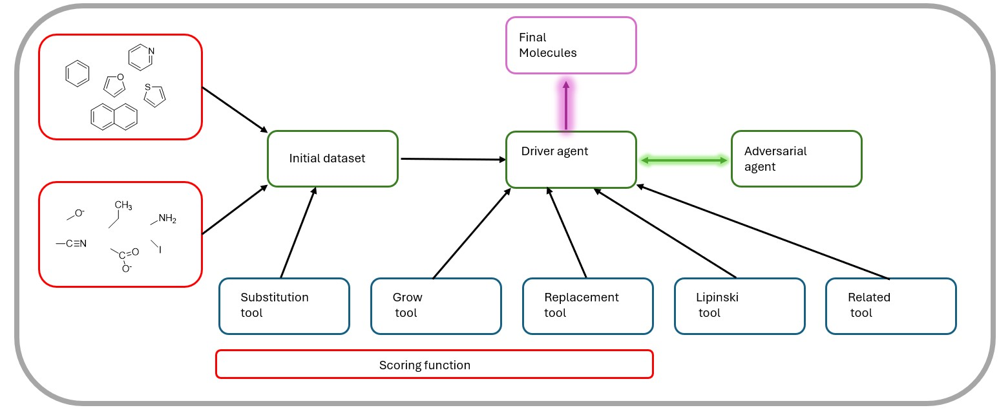
    <figcaption>Figure 1. Workflow for the adversarial deisg process proposed here. Blue boxes are tools; green boxes are LLM nodes or input to the LLM nodes; the purple box is the final output. Note that ony the red boxes (input fragments and the scoring function) need to be changed for any particular task; all other parts of the architecture remain, though different auxilliary functions may be added. </figcaption>
</figure>
<br>

As early as 2023, Bioko *et al* were using OpenAI's GPT 4 in their *Coscientist* to perform 'autonomous design, planning and performance of complex scientific experiments.<sup>1</sup> They used a harness and three LLM-based sub-agents to perform planning, document searching and web-searching tasks, and provided a Python coding environment to execute LLL-designed code. They found that GPT 4 could reason about chemical information well enough to perform many tasks, including synthesis planning. More relevant to this work, Zhang *et al* used GPT4 (and GPT 3.5) in molecule identification and optimization. In one trial, they used a zero-shot approach to ask the LLM to refine a molecule to have a particular QED (quantitative estimate of drug-likeness) value, and found that the model, while at times producing invalid SMILES strings, could reason well about attaining a particular QED and suggested four molecules, though none had the desried value.<sup>2</sup>  Rather than rely on an LLM directly, Wang *et al* used GPT 4 for help with three distinct tasks within  a drug-deisgn workflow: idea generation, concept clarification, and coding help. <sup>3</sup> At that time, GPT 4 provided inaccurate information both about molecules and in the concept clarification regime. Bran *et al* designed the ChemCrow agent (again based on GPT 4), which had access to some simple chemical tools (SMILES to Weight, Func Groups). <sup>4</sup>. They evaluated ChemCrow for several types of chemical tasks; for the molecule design tasks relevant to the current work, they use zero-shot design for two different design tasks. Since the authors did not provide validation or verification of the LLM generated molecules, it is difficult to tell how well the LLM performed on these tasks. 

In a very different use of LLMs for molecule design, Cavanagh *et al* fine-tuned the Llama 3.1 8B Instruct model on chemical information (SmileyLlama). <sup>5</sup> The fine-tuning prompts consisted of SMILES strings of 2M drug-like molecules from ChEMBL along with ADME data for each molecule calculated by RDKit. This fine tuning increased the model's ability to generate valid SMILES as well as molecules with desired properties, with the resulting SMILES similar in property distribution to the original training set. The authors further used a reinforcement learning-type approach to further train the model to generate molecules that would be good inhibitors of a particular enzyme. This aligned model could then generate novel SMILES that could be good inhibitors for the enzyme and adhere to other property requests. This approach uses AutoDock to provide data for the reinforcement learning, while the approach described in the current work uses AutoDock as a tool directly accessible to the foundation model LLM. 

Fan *et al* trained 1-8B parameter models with a novel text-based molecular representation scheme (based on SELFIES) and enhanced numerical embedding (ChatMol).<sup>6</sup> Training data included the molecules and numerical data on properties such as LogP and docking scores. Prompts for the model were descriptions of desired properties and molecular substructures, and outputs were molecule representations. While this method achieved good results, it requires training a model on  dataset. Also, it again uses AutoDock to generate docking scores at training time; the current approach which uses AutoDock at inference time is more efficient, especially as ChatMol must be trained on each desired protein target. 

Closer to the current work, Gao *et al* introduced their *PharmAgents* workflow whch uses multiple LLMs and tools to perform several tasks; their 'Lead Optimization' task is closest to what is described in the currrent work.<sup>7</sup> This task uses four LLMs and Autodock to generate scores for input molecules, suggest alterations, make alterations, generate scores for the new molecules and evaluate. The procedure described here is a more streamlined process with only two LLMs and a of tools that generates molecule analogues based on the user's chosen scaffolds and substituents. PharmAgents tested GPT 4o and 4o-mini and DeepSeek V3 and R1. They observed improvements compared to baseline. Similarly, Kim *et al* proposed MT-Mol, a multi-LLM workflow using tools to design molecules with optimized properties.<sup>8</sup> MT-Mol uses eight LLMs in the design process (five to propose tool use, one to propose molecules, one to verify reasoning and one to review). While the complexity in MT-Mol makes it a more black-box molecule design tool, the modularity of the current proposed workflow, in which the user brings their own scoring function and auxilliary functions, and has the ability to specify fragments, is more bespoke to any particular research problem.  

In the closest published workflow to the current work, Unlu *et al* proposed a multi-LLM molecule optimization system for drug design specifically, using six LLM agents.<sup>9</sup> Two of those LLMs are involved in target selection, and so are irrelavant to the current work where a specific task is specified. The other four are involved in proposed, scoring and evaluating molecule analogues. This system was tested with GPT 4.1, GPT o3, Gemini, and two Claude Sonnet variations. While this work is closely related to the current work, it is at once more broad (working from target selection to molecule validation) and more specific (it is designed for one task: drug design). The modularity and flexibility of the current work is suited to any range of molecule design tasks. An interesting variation that is similar to the current work comes from Brahmavar *et al*. They use successive modification of prompts in a multi-turn sesson with GPT 3 to achieve molecular property optimization.<sup>10</sup> At each turn, they sample datapoints of molecules and their property scores from a large dataset according to the previous LLM response. This is quite similar to the current work, with tool-calling replacing the dynamic sampling. The review of the use of LLMs in molecular optimization from Ramos *et al* from 2024<sup>11</sup> is dated at this point, but the authors keep an online repository with updated information.

This work makes use of fragment-based design of molecules. Fragment based drug design (FBDD) has an over thirty-year history. In classical FBDD, the fragments themselves obey a 'Rule of 3' (derived form Lipinski's Rule of 5), and larger fragments are grown from promising smaller fragments. In the current work, property screening of the fragments is not taken into account, but the workflow does begin with a dataset of fragments (built from scaffolds and substituents) and larger molecules are grown from these fragments. See AlKharboush *et al* for a recent review<sup>12</sup> on FBDD, and Jinsong *et al* for a perspective on how molecular fragmentation can benefit AI/LLM-based workflows in particular.<sup>13</sup>  

Yang *et al* published *DigFrag*, which is a workflow that involved a graph-neural-network trained to fragment drug-like molecules.<sup>14</sup> The obtained fragments are then screened for pharmacophore importance and unimportant fragments are discarded. The fragments obtained were then used in the DeepFMPO model<sup>15</sup> (an RNN) to generate novel molecules with desired traits. These new molecules were then scored using AutoDock. While this work does not use an LLM, the main ideas are close to the current work. 

## Methods

### Fragment-based Molecular Optimization

The automated property optimization requires one or more scaffolds--in SMILES format, defined substitution points for 'clean' molecules (no substituents added), defined substitution points for substituted molecules, a set of substituents to add, a substitution function, a grow function, a replacement function, one or more scoring functions, any desired auxilliary functions (optional).
The workflow for the process begins by adding a random selection of the substituents to the 'clean' substitution points on all selected scaffolds using the substitution function. This set of molecules is then 'scored' by the scoring function. From this point, several paths can follow. A molecule with a promising score can be used with the grow function to add more/different substituents to try to improve the score, or the replacement function may be used on a promising molecule to see how different substituents would change the score. Additional scoring and auxilliary functions may be used to gain additional information on the molecules. These processes are then repeated until a best possible score is achieved. 

In this work, we used the following scaffolds: ```c1ccccc1``` (benzene), ```n1ccccc1``` (pyridine),```o1cccc1``` (furan), ```s1cccc1``` (thiophene), ```[nH]1cccc1``` (pyrrole), ```n1c[nH]cc1``` (imidazole), ```c1ccc2ccccc2c1``` (naphthalene), ```c1ccc2cc3ccccc3cc2c1``` (anthracene), and ```O=c1cc(-c2ccccc2)oc2ccccc12``` (flavone). In practice any set of molecule SMILES may be used as a scaffold. For substituents we used sets of 11 electron withdrawing groups, 16 electron donating groups and 14 linkers. The linkers can be combined with the other two groups, combined with each other, or used alone as substituents themselves. This results in 567 potential substituents. (see supporting information) In practice, we chose a random set of 10 substituents from the 567 available for the initial dataset created with the substitution function.

The clean subtitution points on the scaffolds are all attachment points that are symmetrically unique, i.e., benzene only has one unique attachment point, napthalene has two, anthracene has three, etc. Each of the 567 substituents can be placed on any clean attachment point; since the rings used in this work have a total of 26 attachment points, this results in a total of 14,742 unique molecules that may be generated in an automated fashion. Note that these are only the singly substituted molecules that can be generated by the substitution function--multiply substituted molecules may also be created when using the grow function on a promising molecules generated with the substitution function. In this work, the 10 randomly chosen substituents were added to all attachment points, for a a total of 260 molecules in the intial dataset.

The grow function adds any user-specified set of substituents to any molecules--ususally a promising molecule from the substitution function. The substituents are added in any user-defined locations. For this work, the location were: ```c[0-9]c```, ```1c\[n```, ```cc```, ```c\[nH\]``` (these are regular expressions for SMILES notation). Note that these include any open position on an aromatic ring. The replacement function looks for a user-defined substituent offset in the SMILES string with () and replaces it with an of a user-defined set of substituents. All novel molecules generatd by the grow and replacement functions are scored used the scoring function. 

### Scoring and auxilliary functions

In this work, two scoring functions were tested: docking (using AutoDock Vina<sup>16</sup> via DockString<sup>17</sup>) and HOMO-LUMO gap (HLG; using PySCF<sup>18</sup>). The scoring functions take two inputs: a globally defined ```scoring_args``` variable and the SMILES string of the molecule in question. In this work, the ```scoring_args``` were the protein to dock in ('HMGCR') and the DFT functional to use for gap calculations ('cam-b3lyp'). Along with the scoring fuunction, a 'task specific prompt' is needed to describe the task to be accomlished--this serves as part of the system message for the LLM (see below). In this work, the task specific prompts requested minimzation of docking score and the HOMO-LUMO gap. Since the docking scoring function used the convenient DockString package, all protein preparation is done beforhand by the package authors, and ligand preparation was done on-the-fly by protonating it at a pH of 7.4 using Open Babel<sup>19</sup>, generating a conformation using ETKG from RDKit<sup>20</sup>, optimizing the structure with MMFF94, and computing charges for all atoms using Open Babel, all while maintaining any stereochemistry in the original SMILES string. The prepared molecule is then docked into the protein binding site using AutoDock Vina with default values of exhaustiveness, binding modes, and energy range. The prepared HMGCR binding site from the DUD-E database<sup>21</sup> was used for docking. The HLG scoring function used RDKit to make 3D structures by adding protons, creating a conformer using ETKG from RDKit, and optimizing the structure with MMFF94. A CAM-B3LYP<sup>22</sup>/sto-3g<sup>23</sup> calculation was then performed with PySCF and the HOMO and LUMO energies were retrieved. Note that the small basis set used in this work was chosen to make the proof-of-concept calculations fast; each LLM adversarial turn could generate dozens of molecules and so quick calculations were required. In production, any basis set can be used according to the user's computational resources.  

Two auxiliary functions were provided in this work: a 'Lipinski' module and a 'related' module. The former usses RDKit to calculate the QED, aLogP, molecular weight, etc for a SMILES string, and the latter queries the PubChem API with the SMILES and searches for structurally similar molecules. 'Lipinski' is used to steer molecular design towards feasible drug molecules, and 'related' is used to either perform a 'sense check' on the structure, or to look for other scaffolds in nearby chemical space.   

### LLMs and Agents

Ten LLMs were used in this work. Seven open-weight (OW) models were used in zero- and one-shot molecule design, and three closed-weight (CW) frontier models were used in zero-shot, one-shot and agentic molecular design. The OW models (deepseek-v3.2<sup>24</sup>, gpt-oss:120b<sup>25</sup>, gpt-oss:20b<sup>26</sup>, devstral-2:123b<sup>27</sup>, cogito-2.1:671b<sup>28</sup>, nemotron-3-nano:30b<sup>29</sup>, and kimi-k2.5<sup>30</sup>) were used via the Ollama API on the Ollama cloud<sup>31</sup>. The models were chosen to provide a range of sizes from different labs. On the smaller side are OpenAI's gpt-oss and nemotron-3-nano with 20B and 30B parameters respectively; on the larger side are deepseek-v3.1, cogito-2.1 and kimi-k2 at 671B, 671B and 1T parameters. 

The CW models (GPT5.2<sup>32</sup>, Claude Haiku 4.5<sup>33</sup> and Gemini 3 Flash<sup>34</sup>) were used via the OpenAI, Anthropic and Google APIs. The models were chosen to represent the three most commonly used commercial LLMs. The specific models were chosen to be of similar, middle-of-the-road prices. 
OpenAI's GPT 5.3 had a cost of $1.75 per M input tokens and $14 per M output tokens at the time this work was performed; Claude Haiku had costs of $1 per M input and $5 per M output tokens, and Gemini 3 Flash had a cost of $0.50 per M input and $3 per M output tokens.

In order to give the CW models access to tools, LangGraph<sup>35,36</sup> was used. The LangChain chat interfaces were used for each model and the add_tools method was employed. A simple graph was created for each model with a START node, a model call node, and and END node. Models could calls tools as often as they liked within the model call node. Models maintained state through a ```messages``` list, which included the system message (see below), Human messages and AI messages. Note that tool calling and tool response messages were not kept in the messages list. In this work, the first Human message was the set of input data for each task. Each subsequent Human messages was the response from the adversarial model (see below).

#### Zero-shot

Zero-shot molecule design was carried out in two ways: giving the models freedom to propose any molecule (zero-shot) and telling them the fragments used in the initial dataset and encouraging their use (zero-shot with fragment suggestions). The system prompt used for the zero-shot with fragment suggestions method for docking is shown in the supporting data. The prompt for the plain zero-shot method was the same, but included only the first paragraph, excluding the fragment suggestions. The first user message was 'HMGCR.' The system prompt for the HLG zero-shot design session is also shown in the supporting data, with the same midification for the zero-shot with no fragment suggestions. The first user message was 'cam-b3lyp.' Full model responses can be found in the Github repository. 

#### One-shot

One shot molecule design was carried out similary to the zero-shot design, but the first user message contained an initial dataset for docking or HLG generated with the substitution tool. The prompts for docking and HLG design are given in the supporting information. The initial datasets and full models responses are available in the Github repository and consist of 260 SMILES/scores pairs for each task studied here. 

#### Adversarial design

In adversarial design, the first model is given the initial dataset made with the substitution tool and instructions to use the tools and that data to recommend molecles with the target scores. The output from that model is then passed directly to the adversary model, which is instructed to critique the suggestions and offer advice, corrections and suggestions. The system prompt for adversarial design contains tool descriptions and instructions for tool use, as well as information on the iterative processes, including the existance of the adversary model. The system prompt for the adversary model tells it that it is serving as an adversary and desribes the tools available to the other model so that it can suggest new experiments. The prompts are available in the supporting data, and the initial datasets and full models responses for tboth models are available in the Github repository. 

### Extracting data from the design sessions

At the end of each session, the models suggest up to five final molecules with the desired properties. For adversarial design, often the models have verified the scores (docking score, HLG) with the tools, but other times they offer 'estimates' of the scores. The SMILES for the final molecules were extracted from the model replies and verified with the same scoring functions (an auxilliary functions) used by the models. In zero and one-shot sessions, the SMILES suggested by the models do not complile into viable molecules; in the adversarial sessions, the models sometimes trim their suggestions to fewer than five molecules. Although the prompts include information on how to embed a new ring into an existing SMILES by using higher numbers (i.e., ```c6ccccc6``` rather than ```c1ccccc1```) so as to not conflict with existing rings, in the adversarial session, the Gemini model created molecules incorrectly by embedding new rings with the same numbers as exiting rings. In this case both the original SMILES proposed by Gemini and the 'corrected' SMILES that Gemini though it was creating were verified.

## Results: Minimization of docking scores for HMGCR calculated by AutoDock Vina

For the following analysis, the docking scores and poses and were compared with the docking scores for six known statins obtained via the same code: −8.3 kcal/mol for atorvastatin, −8.5 for rosuvastatin, −8.6 for fluvastatin, −7.6 for simvastatin, −7.6 for lovastatin, and −7.1 for pravastatin. The average docking score for the three type-2 statins (first three) is −8.5, and the average for the three type-1 statins is −7.4.The overall average docking score for the six statins is −7.95 kcal/mol. The statins have an average QED of 0.47 and an average aLogP of 4.09. The known most potent statin is Rosuvastatin (IC50 0.16 nM)<sup>37</sup>, which has a QED of 0.47 and an aLogP of 2.40. Thus, we will use aLogP of 2.40 as a target for molecule design. The docking pose of Rosuvastatin is used as a baseline for all docking poses (both the novel ligand and Rosuvastatin are shown in each pose image). 

### Zero-shot

When prompted to generate inhibitors for HMGCR, the three CW models, DeepSeek and Kimi K2 produced variations on the standard Type II statin molecules, featuring the carboxy-diol pharmacophore structure in particular. The other OW models produced random drug-like molecules of approximately the correct size and polarity (See Figure 2, as well as Figures 1, 4, 7, 10, 13, 16, 19, 22, 25 and 27 in the supporting data). For the CW plus DeepSeek and Kimi-K2 (CWDK) models, Claude and Kimi-K2 had molecules with the the overall lowest docking score (-8.30, Table 1), though Kimi-K2 produced a higher QED (0.64 vs. 0.46 for Claude, Table 6). Gemini had the second lowest docking score (-8.10) and the lowest average score (-8.0), though it only produced two viable SMILES, had a lower QED (0.39) and a relatively high aLogP (4.39). GPT 5.2 produced molecules of average quality, and was outperformed by Cogito 2.1 in both Docking score, QED and aLogP (Table 7). GPT OSS 20 and 120 had the highest average scores of all models tested. 

Supporting data Figures 30, 33, 36, 39, 42, 45, 48, 51, 54 and 57 show the docking poses for the zero shot molecule with the lowest docking score for each model. Of the three CW models, only the molecule from Claude docked into the main catalytic site characterized by binding to Lys, Ser, Asp and Asn residues (shown in the figure by the grey Rosuvastatin docking pose). The molecule from GPT 5.2 and Gemini docked into two adjacent sites, which are in the general area occupied by the natural substrate, HMG Coenzyme A. The top zero-shot molecule from every OW model docked into the main catalytic site and overlapped with the position taken up by Rosuvastatin.  

#### Table 1. Docking Scores (kcal/mol) for zero shot molecules for each model tested. 

| Model | No. Mols | Low | High | Ave |
|-------|:-:|:-:|:-:|---|
| GPT 5.2  | 5 | -7.70 | -6.70 | -7.18 |
| Claude   | 3 | -8.30 | -6.40 | -7.20 |
| Gemini   | 2 | -8.10 | -7.90 | -8.00 |
||||||
| Deepseek V3.1  | 4 | -7.40 | -7.00 | -7.13 |
| GPT OSS 120B   | 5 | -7.40 | -6.10 | -6.74 | 
| GPT OSS 20B    | 4 | -6.90 | -6.00 | -6.43 |
| Devstral 2     | 5 | -7.20 | -6.70 | -6.92 |
| Cogito 2.1     | 5 | -8.00 | -6.90 | -7.4 |
| Nemotron 3 Nano| 2 | -7.50 | -6.90 | -7.20 |
| Kimi K2        | 5 | -8.30 | -7.00 | -7.78 |

<figure>
    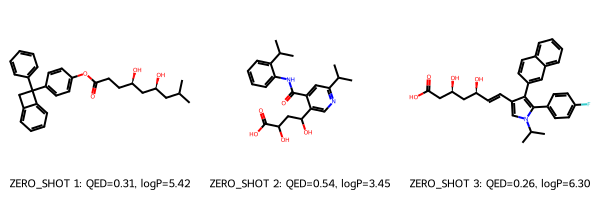
    <figcaption>Figure 2. Lowest docking score zero-shot molecules for GPT 5.2, Claude and Gemini.</figcaption>
</figure>

### Zero-shot with suggested fragments

When asked to generate HMGCR inhibitors and given a set of SMILES fragments to work with, the already well performing Claude maintained roughly the same docking scores (Table 2), while GPT 5.2, Gemini, DeepSeek, GPT OSS 20, and Devstral saw improved scores. The remaining models saw higher docking scores, and Nemotron failed to produce any viable SMILES strings. Gemini and Kimi-K2 largely ignored the suggested fragments and produced more statin-like molecules, while all other models used the fragments (usually the napthalene core) and added the carboxyl suggested fragment (see Figure 3, as well as Figures 2, 5, 8, 11, 14, 17, 20, 23 and 28 in the supporting data). All models other than Gemini improved their QED scores (Tables 6, 7). aLogP values generally improved, other than Claude, Gemini, DeepSeek and OSS 120, which saw their aLogP values more closer to the edges of the Rule of 5 boundaries. In the zero-shot with suggested fragments design session, Gemini had the best docking score overall (-8.50, as well as the best average score) followed by GPT 5.2 and Devstral 2 (-8.30) and Claude (-8.10). 

Supporting data Figures 31, 34, 37, 40, 43, 46, 49, 52, and 55 show the docking poses for the zero shot with suggested fragments molecule with the lowest docking score for each model (nemotron did not produce valid SMILES for zero-shot with fragments). Of the CW models, the top molecules from Claude and Gemini docked into the main binding site and overlapped with Rosuvastatin. The molecule from GPT 5.2 bound to one of the two neighboring sites again. Of the OW models, the molecules from GPT OSS20 and Cogito did not dock in main binding site, but occupied the same adjacent sites that the GPT 5.2 and Gemini-produced molecules occupied; all other OW-produced molecules docked in the main binding site. 

#### Table 2. Docking Scores (kcal/mol) for zero shot molecules with suggested fragments for each model tested. 

| Model | No. Mols | Low | High | Ave |
|-------|:-:|:-:|:-:|---|
| GPT 5.2  | 4 | -8.30 | -6.40 | -7.15 |
| Claude   | 5 | -8.10 | -6.40 | -7.46 |
| Gemini   | 4 | -8.50 | -7.80 | -8.13 |
||||||
| Deepseek V3.1  | 2 | -7.70 | -5.30 | -6.50 |
| GPT OSS 120B   | 4 | -6.70 | -5.80 | -6.15 | 
| GPT OSS 20B    | 2 | -7.60 | -6.30 | -6.94 |
| Devstral 2     | 5 | -8.30 | -6.50 | -7.12 |
| Cogito 2.1     | 4 | -7.00 | -6.70 | -6.88 |
| Nemotron 3 Nano| 0 | - | - | - |
| Kimi K2        | 5 | -7.40 | -6.10 | -6.76 |

<figure>
    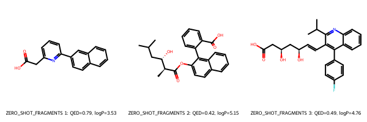
    <figcaption>Figure 3. Lowest docking score zero-shot molecules with fragment suggestions for GPT 5.2, Claude and Gemini.</figcaption>
</figure>

### One-shot

When the models were given the SMILES/docking scores dataset and asked to generate HMGCR inhibitors, docking scores improved across the board, show strong few-shot learning from the models. All models other than OSS 20 saw lower 'best' docking scores and average docking scores, while OSS 20 saw a slightly increased 'best' scores but an improved average score. Gemini still had the lowest docking score (-9.20), followed by Nemotron (-9.10), Claude (-9.00), and GPT 5 (-8.90). While Devstral lagged behind these 4 leaders (-8.60), it had the lowest average docking score (-7.90). All models used the fragments present in the sample dataset, and most models used a napthalene or flavone scaffold, except for DeepSeek which opted for the anthrcene scaffold (See Figure 4, as well as Figures 3, 6, 9, 12, 15, 18, 21, 24, 26 and 29 in the supporting data). Gemini saw a significant improvement in QED and aLogP due to finally letting go of the statin-molecule motif and using the suggested fragments (Table 6). All other models saw smaller changes in QED and aLogP either better or slightly worse (Tables 6, 7). It should be noted that the sample data set had a lowest docking score of -8.6, and only the CW models and Nemotron beat that score, and Devstral tied it.

Supporting data Figures 32, 35, 37, 41, 44, 47, 50, 53, 56 and 58 show the docking poses for the one-shot molecule with the lowest docking score for each model. Of the CW models, only the molecule from Gemini did not dock in the main binding site. Thus, for the zero-, zero-with-fragments, and one-shot molecules generated by the CW models, only Claude consistently generate molecules that docked into the main bind site each time, and only GPT 5.2 never produced a top molecule that docked into the main binding site. Of the OW models, Cogito, Kimi K2 and Devstral produced molecules that did not dock the main binding site; all others did occup the main binding site. Only Deepseek and GPT OSS20 produced molecules that docked into the main bindin site in every design mode. 

#### Table 3. Docking Scores (kcal/mol) for one shot molecules for each model tested. The highest docking score given in the one-shot dataset was -8.6 kcal/mol.

| Model | No. Mols | Low | High | Ave |
|-------|:-:|:-:|:-:|---|
| GPT 5.2  | 5 | -8.90 | -7.20 | -7.82 |
| Claude   | 5 | -9.00 | -7.40 | -8.42 |
| Gemini   | 5 | -9.20 | -7.30 | -8.14 |
||||||
| Deepseek V3.1  | 4 | -8.20 | -7.50 | -7.80 |
| GPT OSS 120B   | 5 | -7.90 | -6.80 | -7.26 | 
| GPT OSS 20B    | 1 | -7.50 | -7.50 | -7.5 |
| Devstral 2     | 4 | -8.60 | -7.90 | -8.20 |
| Cogito 2.1     | 5 | -8.50 | -7.50 | -8.1 |
| Nemotron 3 Nano| 3 | -9.10 | -7.60 | -8.26 |
| Kimi K2        | 4 | -7.50 | -6.90 | -7.15 |

<figure>
    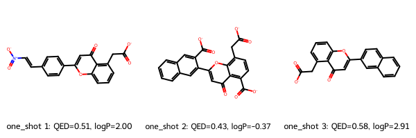
    <figcaption>Figure 4. Lowest docking score one-shot molecules for GPT 5.2, Claude and Gemini.</figcaption>
</figure>

### Adversarial design

The CWDK models were tested in adversarial design sessions, where they were given in the intial dataset and allowed the use of scoring and auxilliary tools to test hypotheses on good inhibitor molecules. Additionally, their output was passed to another model which then offered criticism of their proposal. The first model then revised its proposal using the tools to refine the proposed molecules. This back-and-forth process between the models was continued until the suggested molecules stabilized, meaning the models were not suggesting any further meaningful changes. Transcripts of all adversarial design sessions are available on the Github repo for this work, and are organized by 'initial model response,' 'adversary response,' and 'model response.' In most cases, the molecules presented here as the final molecules (finalists) were the ones from the last 'model response.' In the case of Claude, it had suggested some molecules with very low scores a few turns earlier, but was convinced by GPT 5.2 to abandon them; those two abanadoned molecules were included here as finalists. In the case of Kimi K2, the criticism from GPT 5.2 convinced it to only put forward one molecule, and to offer many caveats on actually using it; no other model was so deferential to the adversary. In that case, we included two molecules from an earlier turn with low scores, which GPT 5.2 had convinced Kimi K2 to abandon. Finally, DeepSeek was the only one of the CWDK models that occasionally introduced errors into the tool calls. The errors it introduced were always in the ```best score``` variable in the replacement function and the grow function; it supplied random strings rather than a float representing the best score. In these cases the model was sent the follwing message: ```you had an error in your last tool call. You listed a best score as "-F" this should be a float. Please correct and continue.``` In each case it continued as normal (remember: state was maintained by storing all system, user and assistant messages and sending them as context in every turn). 

Table 4 shows the docking score results for these adversarial sessions. Claude generated the molecule with the lowest score, followed by DeepSeek. Gemeini was the ony other model to generate a molecule with a score lower than -9.0 (remember: the baseline lowest score in the intial dataset was -8.6).  Gemini, however, had the lowest average score, followed by Claude and GPT 5.2. Kimi K2 was somwhat unremarkable in the adversarial session, perhaps owing to the deference it paid the adversary. In 'chat' situations, this is often called sycophancy, and it may be a serious detriment to scientific development with aligned fronteir models. The molecules generated by DeepSeek and Kimi K2 were considerably more 'creative' than those generated by the CW models (see Figures 4-8). 

Table 5 shows that from zero-shot, through zero-shot with suggested fragments, through one-shot and to adversarial design, all of the CWDK models other than Kimi K2 improved in lowest docking score, average docking score or both. Kimi K2's best performance was adversarial design, followed by zero-shot. The biggest improvements usually came between zero-shot with suggested fragments/one-shot or between one-shot/adversarial design. From zero-shot to adversarial design, DeepSeek and Claude showed the biggest improvements, both in lowest score and average score (2.1 and 1.6 kcal/mol for DeepSeek and 1.6 and 1.8 kcal/mol for Claude). This can imply that these models are most adept at learning from provided context either at the start of a conversation or through tool use. Kimi K2 had the lowest improvement, 0.5 and 0.7 kcal/mol for lowest score and average score. Gemini has the second lowest improvement, but it started from a fairly good place. 

The prompts for this task specifically asked for drug-like molecules, and in the adversarial design sessions, the models used the ```lipinski``` tool often to vaildate their choices. Table 6 shows how the aLogP and QED values changed as the models progressed from zero-shot --> zero-shot with suggested fragments --> one-shot --> adversarial design. QED values improved across the board and converged near and average of 0.7 for all models other than DeepSeek, which had and average near 0.5. In the desgign session logs, it can be seen that the models often discarded molecules for having poor ADME properties. aLogP also improved for the models, converging near ~2.00 for Claude, Gemini and Kimi K2, and near ~4 for GPT 5.2 and DeepSeek. Figures 5-9 show the molecules generated for each model. 

The current author recently published a transformer-decoder model fine-tuned to generate inhibitors of HMGCR.<sup>38</sup> In that work, a novel token sampling technique was used to obtain low docking scores for molecules in HMGCR. The best sampling technique in that work had an average docking score of -8.08, which is higher than all of the average docking scores for the adversarial design sessions. Those generated molecules has a QED of 0.44 and an aLogP of 4.8. Again, every adversarial design session produced molecules with higher QED values and more moderate aLogP values.  

#### Table 4. Docking Scores (kcal/mol) for adversarially designed molecules for each model tested. The highest docking score given in the one-shot dataset was -8.6 kcal/mol.

| Model | Adversary |  No. Mols | Low | High | Ave |
|-------|:-:|:-:|:-:|:-:|---|
| GPT 5.2  | Claude  | 2 | -8.90 | -8.90 | -8.90 |
| Claude   | GPT 5.2 | 5 | -9.90 | -8.10 | -8.96 |
| Gemini   | Claude  | 5 | -9.10 | -8.90 | -8.98 |
| DeepSeek | GPT 5.2 | 4 | -9.50 | -8.19 | -8.68 |
| Kimi K2  | GPT 5.2 | 3 | -8.80 | -8.10 | -8.53 |

<figure>
    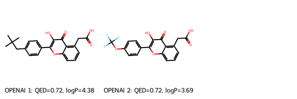
    <figcaption>Figure 5. Top molecules for GPT 5.2.</figcaption>
</figure>


<figure>
    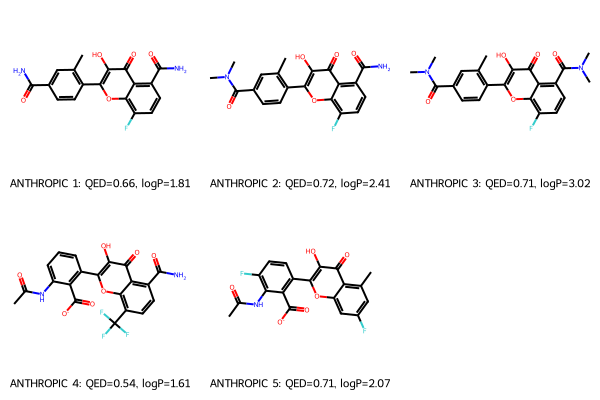
    <figcaption>Figure 6. Top molecules for Claude.</figcaption>
</figure>

<figure>
    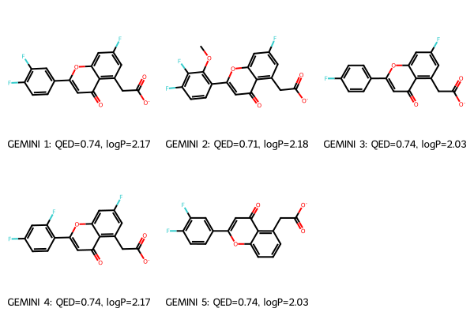
    <figcaption>Figure 7. Top molecules for Gemini.</figcaption>
</figure>

<figure>
    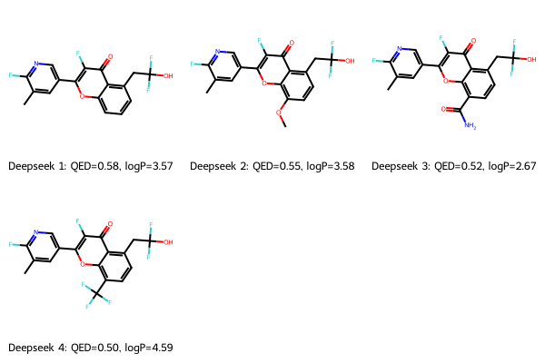
    <figcaption>Figure 8. Top molecules for DeepSeek.</figcaption>
</figure>

<figure>
    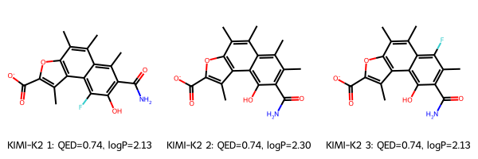
    <figcaption>Figure 9. Top molecules for Kimi K2.</figcaption>
</figure>

#### Table 5. Docking Scores (kcal/mol) progression for zero-shot, one-shot, and adversarially designed molecules for each model tested. The highest docking score given in the one-shot dataset was -8.6 kcal/mol.

| Model | design mode | No. Mols | Low | High | Ave |
|-------|:-:|:-:|:-:|:-:|---|
| GPT 5.2  | zero-shot | 5 | -7.70 | -6.70 | -7.18 |
| GPT 5.2  | zero/frags| 4 | -8.30 | -6.40 | -7.15 |
| GPT 5.2  | one-shot  | 5 | -8.90 | -7.20 | -7.82 |
| GPT 5.2  | w/ Claude | 2 | -8.90 | -8.90 | -8.90 |
||||||
| Claude   | zero-shot | 3 | -8.30 | -6.40 | -7.20 |
| Claude   | zero/frags| 5 | -8.10 | -6.40 | -7.46 |
| Claude   | one-shot  | 5 | -9.00 | -7.40 | -8.42 |
| Claude   | w/ GPT 5.2| 5 | -9.90 | -8.10 | -8.96 |
||||||
| Gemini   | zero-shot | 2 | -8.10 | -7.90 | -8.00 |
| Gemini   | zero/frags| 4 | -8.50 | -7.80 | -8.13 |
| Gemini   | one-shot  | 5 | -9.20 | -7.30 | -8.14 |
| Gemini   | w/ Claude | 5 | -9.10 | -8.90 | -8.98 |
||||||
| DeepSeek   | zero-shot | 4 | -7.40 | -7.00 | -7.13 |
| DeepSeek   | zero/frags| 2 | -7.70 | -5.30 | -6.50 |
| DeepSeek   | one-shot  | 4 | -8.20 | -7.50 | -7.80 |
| DeepSeek   | w/ GPT 5.2| 4 | -9.50 | -8.19 | -8.68 |
||||||
| Kimi K2    | zero-shot | 5 | -8.30 | -7.00 | -7.78 |
| Kimi K2    | zero/frags| 5 | -7.40 | -6.10 | -6.76 |
| Kimi K2    | one-shot  | 4 | -7.50 | -6.90 | -7.15 |
| Kimi K2    | w/ GPT 5.2| 3 | -8.80 | -8.10 | -8.53 |

#### Table 6. Average QED and aLogP for from each CW model / design mode.

| Model | design mode | QED | aLogP |
|-------|:-:|:-:|---|
| GPT 5.2  | zero-shot | 0.19 | 5.10 |
| GPT 5.2  | zero/frags| 0.72 | 3.77 |
| GPT 5.2  | one-shot  | 0.64 | 1.20 |
| GPT 5.2  | w/ Claude | 0.72 | 4.04 |
||||||
| Claude   | zero-shot | 0.46 | 1.22 |
| Claude   | zero/frags| 0.57 | 4.80 |
| Claude   | one-shot  | 0.55 | 0.34|
| Claude   | w/ GPT 5.2| 0.67 | 2.18 |
||||||
| Gemini   | zero-shot | 0.39 | 4.39 |
| Gemini   | zero/frags| 0.38 | 5.19 |
| Gemini   | one-shot  | 0.71 | 1.56 |
| Gemini   | w/ Claude | 0.73 | 2.12 |
||||||
| Deepseek V3.1  | zero-shot | 0.55 | 2.31 |
| Deepseek V3.1  | zero/frags| 0.57 | 0.96 |
| Deepseek V3.1  | one-shot  | 0.49 | 2.13 |
| DeepSeek V3.2  | w/ GPT 5.2| 0.54 | 3.60 |
||||||
| Kimi K2  | zero-shot | 0.64 | 3.67 |
| Kimi K2  | zero/frags| 0.74 | 1.73 |
| Kimi K2  | one-shot  | 0.62 | 3.79 |
| Kimi K2.5| w/ GPT 5.2| 0.74 | 2.18 |


#### Table 7. Average QED and aLogP for from each OW model / design mode (excluding Deepseek and Kimi K2).

| Model | design mode | QED | aLogP |
|-------|:-:|:-:|---|
| GPT OSS 120B  | zero-shot | 0.55 | 5.15 |
| GPT OSS 120B  | zero/frags| 0.61 | 0.27 |
| GPT OSS 120B  | one-shot  | 0.39 | 3.29 |
||||||
| GPT OSS 20B  | zero-shot | 0.59 | 3.03 |
| GPT OSS 20B  | zero/frags| 0.63 | 2.91 |
| GPT OSS 20B  | one-shot  | 0.68 | 1.61 |
||||||
| Devstral 2  | zero-shot | 0.55 | 1.75 |
| Devstral 2  | zero/frags| 0.70 | 2.71 |
| Devstral 2  | one-shot  | 0.64 | 1.53 |
||||||
| Cogito 2.1  | zero-shot | 0.81 | 3.15 |
| Cogito 2.1  | zero/frags| 0.83 | 2.65 |
| Cogito 2.1  | one-shot  | 0.59 | 1.28 |
||||||
| Nemotron 3 Nano  | zero-shot | 0.62 | 0.58 |
| Nemotron 3 Nano  | zero/frags| 0.00 | 0.00 |
| Nemotron 3 Nano  | one-shot  | 0.37 | 5.19 |

### Pose analysis and comparison with known binders 

Rosuvastatin docks in the known catalytic site for HMGCR, with the carboxyl-diol moiety binding to Lys, Asp, Ser, and Asn residues. Figures 9-13 show the top poses from each of the CWDK model adversarial deisgn sessions along with the best docked pose for Rosuvastatin. At least one of the top molecules for Claude, Deepseek and Kimi K2 docked in the same pocket as Rosuvastatin (Figures 11, 13 and 14). Kimi K2's lowest score pose was in the Rosuvastatin pocket, but for Claude, only the second lowest docking score pose was in pocket (-9.4 kcal/mol), and for Deepseek it was the third lowest (-8.3 kcal/mol). None of the top poses for GPT 5.2 or Gemini were in the Rosuvastatin pocket. They docked just outside the pocket, but still within the general area taken up by the natural substrate, HMG-Coenzyme A (see Figures 10 and 12). Thus, while these two models do not act ad competitive inhibitors directly, they can interfere with the normal enzyme funcrtion. 

<figure>
    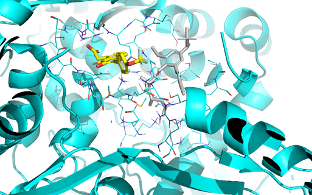
    <figcaption>Figure 10. Best pose for GPT 5.2 in the HMGCR binding site. The grey molecule is the docked known statin, Rosuvastatin <figcaption>
</figure>

<figure>
    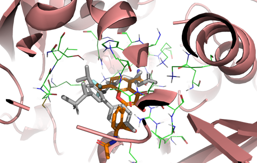
    <figcaption>Figure 11. Best pose for Claude in the HMGCR binding site; this was for the second lowest docking score, -9.4 kcal/mol. The grey molecule is the docked known statin, Rosuvastatin <figcaption>
</figure>

<figure>
    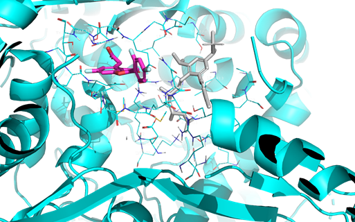
    <figcaption>Figure 12. Best pose for Gemini in the HMGCR binding site. The grey molecule is the docked known statin, Rosuvastatin <figcaption>
</figure>

<figure>
    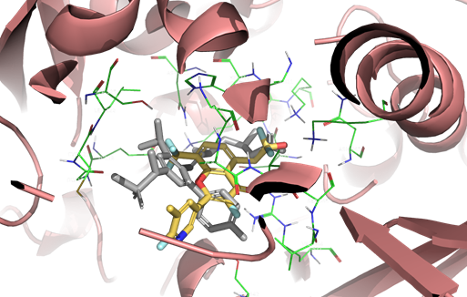
    <figcaption>Figure 13. Best pose for Deepseek in the HMGCR binding site; this was for the third lowest docking score, -8.3 kcal/mol. The grey molecule is the docked known statin, Rosuvastatin. <figcaption>
</figure>

<figure>
    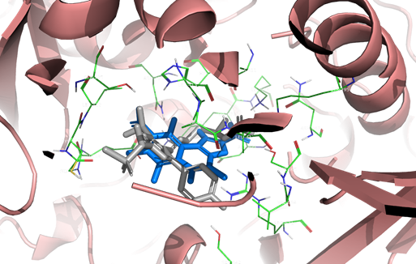
    <figcaption>Figure 14. Best pose for Kimi K2 in the HMGCR binding site. The grey molecule is the docked known statin, Rosuvastatin. <figcaption>
</figure>

## Minimization of the HOMO-LUMO gap as calculated with CAM-B3LYP/sto-3g in PySCF.Molecule structures optimized with MMFF.

In order to show the generality of the agentic framework proposed here, the design process was repeated for the task of minimizing the HOMO-LUMO gap (HLG) for molecules. All models were tested in zero-, zero-with-fragments, and one-shot design, and the CW models were tested in adversarial design. When asked to generate molecules with the lowest possible HLG in a zero-shot approach, 

#### Table 8. HOMO-LUMO gaps (eV) for zero shot molecules for each model tested. 

| Model | No. Mols | High | Low | Ave |
|-------|:-:|:-:|:-:|---|
| GPT 5.2  | 5 | 7.57 | 5.04 | 6.17 |
| Claude   | 5 | 8.62 | 2.75 | 5.75 |
| Gemini   | 3 | 4.23 | 3.42 | 3.75 |
||||||
| Deepseek V3.1  | 3 | 9.31 | 3.42 | 6.32 |
| GPT OSS 120B   | 3 | 6.91 | 2.21 | 4.12 | 
| GPT OSS 20B    | 2 | 6.51 | 5.75 | 6.12 |
| Devstral 2     | 2 | 5.58 | 4.62 | 5.10 |
| Cogito 2.1     | 5 | 7.77 | 5.84 | 6.54 |
| Nemotron 3 Nano| 0 | - | - | - |
| Kimi K2        | 4 | 5.00 | 3.79 | 4.50 |

<figure>
    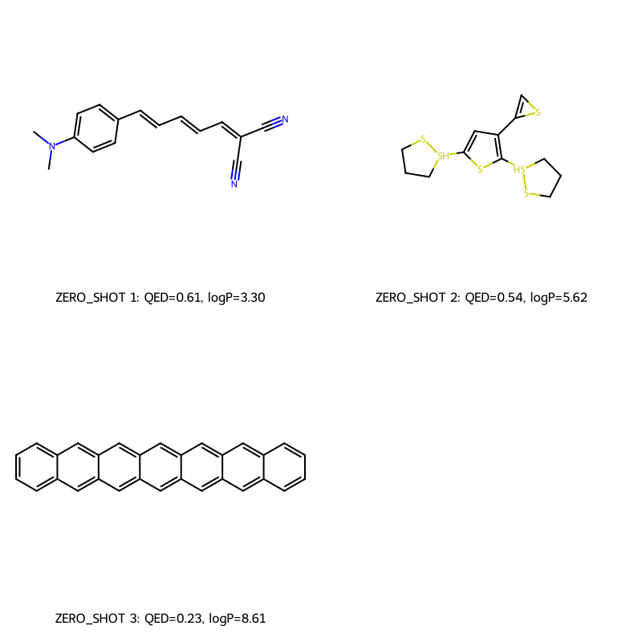
    <figcaption>Figure 14. Lowest HOMO-LUMO gap zero-shot molecules for GPT 5.2, Claude and Gemini.</figcaption>
</figure>


#### Table 9. HOMO-LUMO gaps (eV) for zero shot molecules with suggested fragments for each model tested.

| Model | No. Mols | High | Low | Ave |
|-------|:-:|:-:|:-:|---|
| GPT 5.2  | 5 | 7.03 | 5.76 | 6.19 |
| Claude   | 4 | 7.62 | 5.94 | 7.11 |
| Gemini   | 5 | 7.26 | 5.37 | 6.10 |
||||||
| Deepseek V3.1  | 4 | 7.53 | 5.69 | 6.47 |
| GPT OSS 120B   | 2 | 7.25 | 6.68 | 6.97 | 
| GPT OSS 20B    | 4 | 7.67 | 5.78 | 6.66 |
| Devstral 2     | 2 | 7.03 | 5.89 | 6.46 |
| Cogito 2.1     | 4 | 7.14 | 6.66 | 6.87 |
| Nemotron 3 Nano| 0 | - | - | - |
| Kimi K2        | 4 | 7.32 | 5.78 | 6.35 |

<figure>
    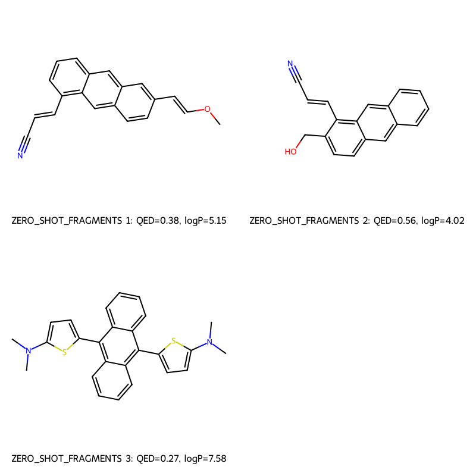
    <figcaption>Figure 15. Lowest HOMO-LUMO gap zero-shot molecules with fragment suggestions for GPT 5.2, Claude and Gemini.</figcaption>
</figure>


#### Table 10. HOMO-LUMO gaps (eV) for one shot molecules for each model tested. The lowest HOMO-LUMO gap given in the one-shot dataset was 5.579 eV.

| Model | No. Mols | High | Low | Ave |
|-------|:-:|:-:|:-:|---|
| GPT 5.2  | 1 | 7.08 | 7.08 | 7.08 |
| Claude   | 4 | 7.34 | 2.46 | 5.95 |
| Gemini   | 5 | 5.95 | 4.26 | 5.26 |
||||||
| Deepseek V3.1  | 1 | 3.46 | 3.46 | 3.46 |
| GPT OSS 120B   | 0 | - | - | - | 
| GPT OSS 20B    | 4 | 7.55 | 4.76 | 6.27 |
| Devstral 2     | 3 | 5.92 | 5.82 | 5.87 |
| Cogito 2.1     | 2 | 7.57 | 3.48 | 5.53 |
| Nemotron 3 Nano| 1 | 9.50 | 9.50 | 9.50 |
| Kimi K2        | 5 | 7.52 | 5.69 | 6.10 |

<figure>
    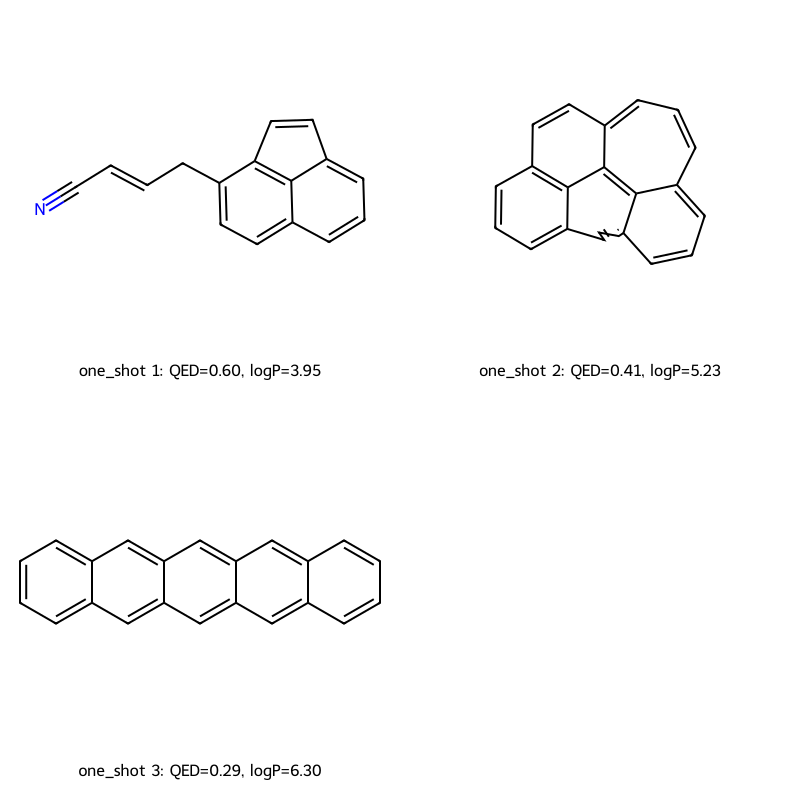
    <figcaption>Figure 16. Lowest HOMO-LUMO gap one-shot molecules for GPT 5.2, Claude and Gemini.</figcaption>
</figure>


#### Table 11. HOMO-LUMO gaps (eV) for adversarially designed molecules for each model tested. TThe lowest HOMO-LUMO gap given in the one-shot dataset was 5.579 eV.
/*correction for the SMILES error in the Claude session.

| Model | Adversary |  No. Mols | High | Low | Ave |
|-------|:-:|:-:|:-:|:-:|---|
| GPT 5.2  | Claude  | 3 | 3.95 | 3.91 | 3.93 |
| Claude   | GPT 5.2 | 3 | 3.10 | 2.98 | 3.06 |
| Claude*   | GPT 5.2 | 3 | 6.49 | 6.03 | 6.28 |
| Gemini   | Claude  | 2 | 1.49 | 1.39 | 1.44 |

<figure>
    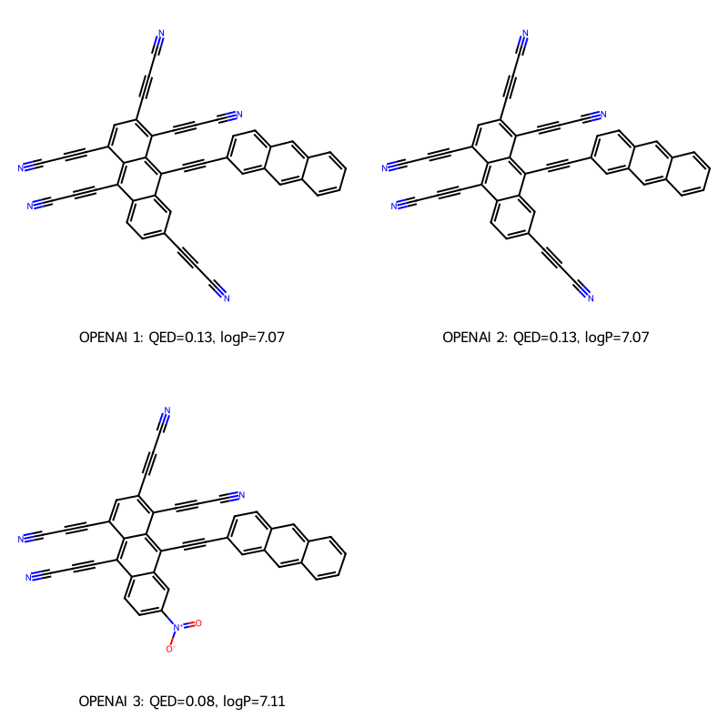
    <figcaption>Figure 17. Top HOMO-LUMO gap molecules for GPT 5.2.</figcaption>
</figure>


<figure>
    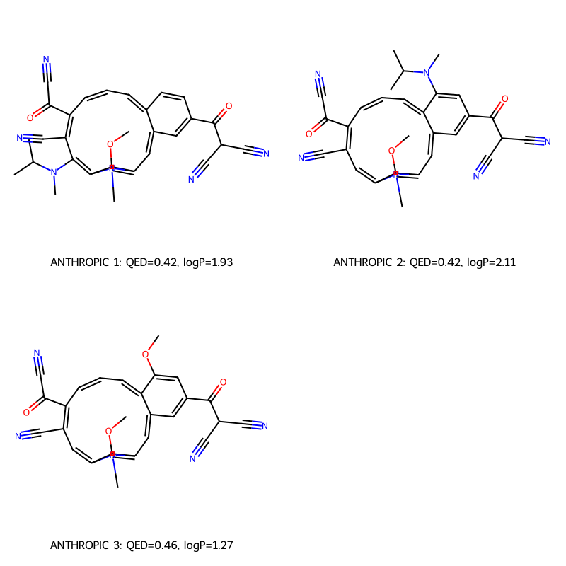
    <figcaption>Figure 18. Top HOMO-LUMO gap molecules for Claude.</figcaption>
</figure>

<figure>
    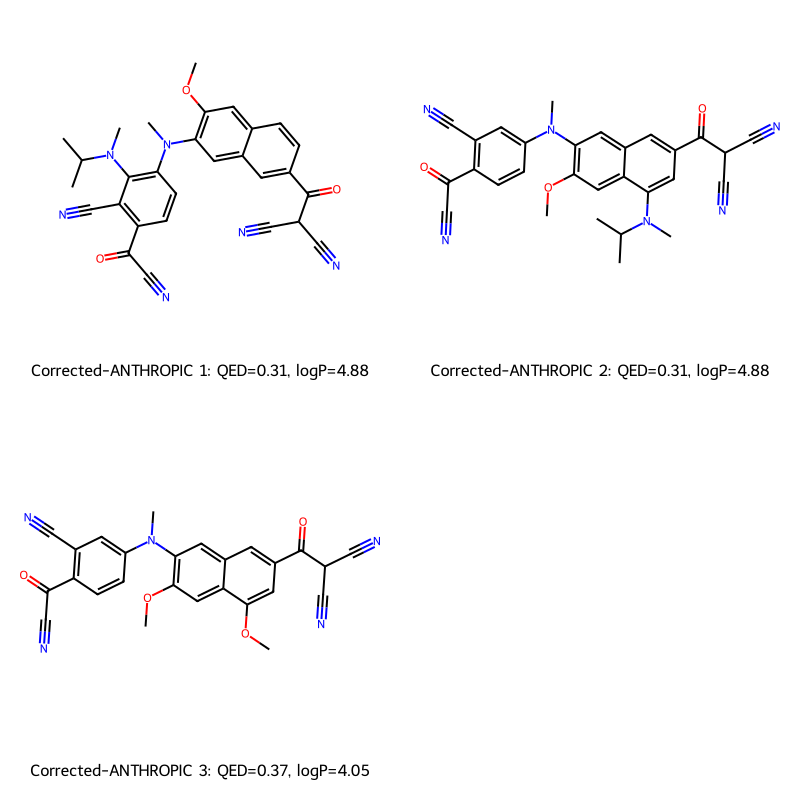
    <figcaption>Figure 19. Top HOMO-LUMO gap corrected molecules for Claude.</figcaption>
</figure>

<figure>
    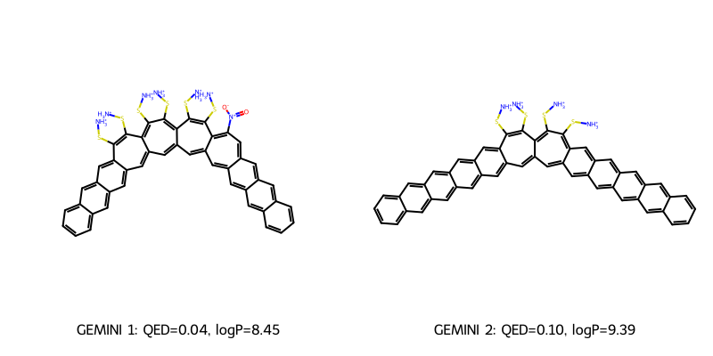
    <figcaption>Figure 20. Top HOMO-LUMO gap molecules for Gemini.</figcaption>
</figure>


#### Table 12. HOMO-LUMO gap (eV) progression for zero-shot, one-shot, and adversarially designed molecules for each model tested. The lowest HOMO-LUMO gap given in the one-shot dataset was 5.579 eV.

| Model | design mode | No. Mols | High | Low | Ave |
|-------|:-:|:-:|:-:|:-:|---|
| GPT 5.2  | zero-shot | 5 | 7.57 | 5.04 | 6.17 |
| GPT 5.2  | zero/frags| 5 | 7.03 | 5.76 | 6.19 |
| GPT 5.2  | one-shot  | 1 | 7.08 | 7.08 | 7.08 |
| GPT 5.2  | w/ Claude | 3 | 3.95 | 3.91 | 3.93 |
||||||
| Claude   | zero-shot | 5 | 8.62 | 2.75 | 5.75 |
| Claude   | zero/frags| 4 | 7.62 | 5.94 | 7.11 |
| Claude   | one-shot  | 4 | 7.34 | 2.46 | 5.95 |
| Claude   | w/ GPT 5.2| 3 | 3.10 | 2.98 | 3.06 |
||||||
| Gemini   | zero-shot | 3 | 4.23 | 3.42 | 3.75 |
| Gemini   | zero/frags| 5 | 7.26 | 5.37 | 6.10 |
| Gemini   | one-shot  | 5 | 5.95 | 4.26 | 5.26 |
| Gemini   | w/ Claude | 2 | 1.49 | 1.39 | 1.44 |

## Conclusions


## References

1. Boiko, D. A.; MacKnight, R.; Kline, B.; Gomes, G. Autonomous Chemical Research with Large Language Models. *Nature* **2023**, *624*, 570–578. https://doi.org/10.1038/s41586-023-06792-0.

2. Zhang, J.; Fang, Y.; Zhang, N.; Shao, X.; Chen, H.; Fan, X. Exploring the Potential of Large Language Models in Molecular Tasks: An Insightful Evaluation with GPT-4. *bioRxiv* **2023**. https://doi.org/10.1101/2023.11.28.568966.

3. Wang, R.; Feng, H.; Wei, G.-W. ChatGPT in Drug Discovery: A Case Study on Anticocaine Addiction Drug Development with Chatbots. *J. Chem. Inf. Model.* **2023**, *63*, 7189–7209. https://doi.org/10.1021/acs.jcim.3c01429.

4. Bran, A. M.; Cox, S.; Schilter, O.; Baldassari, C.; White, A. D.; Schwaller, P. ChemCrow: Augmenting Large-Language Models with Chemistry Tools. *ArXiv*, 2023. https://doi.org/10.48550/arxiv.2304.05376.

5. Cavanagh, J. M.; Sun, K.; Gritsevskiy, A.; Bagni, D.; Bannister, T. D.; Head-Gordon, T. SmileyLlama: Modifying Large Language Models for Directed Chemical Space Exploration. *ArXiv* **2024**, *abs/2409.02231*. https://doi.org/10.48550/arxiv.2409.02231.

6. Fan, C.; Cao, Z.; Ma, Z.; Yu, N.; Peng, Y.; Zhang, J.; Gao, Y.; Fu, G. ChatMol: A Versatile Molecule Designer Based on the Numerically Enhanced Large Language Model. *ArXiv* **2025**, *abs/2502.19794*. https://doi.org/10.48550/arxiv.2502.19794.

7. Gao, B.; Huang, Y.; Liu, Y.; Xie, W.; Ma, W.-Y.; Zhang, Y.-Q.; Lan, Y. PharmAgents: Building a Virtual Pharma with Large Language Model Agents. *ArXiv* **2025**, *abs/2503.22164*. https://doi.org/10.48550/arxiv.2503.22164.

8. Kim, H.; Jang, Y.; Ahn, S. MT-Mol: Multi Agent System with Tool-Based Reasoning for Molecular Optimization. *Findings Assoc. Comput. Linguist.: EMNLP* **2025**, 11544–11573. https://doi.org/10.18653/v1/2025.findings-emnlp.619.

9. Ünlü, A.; Rohr, P.; Çelebi, A. An Auditable Agent Platform for Automated Molecular Optimisation. *ArXiv* **2508**, *abs/2508.03444*. https://doi.org/10.48550/arxiv.2508.03444.

10. Brahmavar, S. B.; Srinivasan, A.; Dash, T.; Krishnan, S. R.; Vig, L.; Roy, A.; Aduri, R. Generating Novel Leads for Drug Discovery Using LLMs With Logical Feedback. AAAI 2024, 38, 21-29.

11. Ramos, M. C.; Collison, C. J.; White, A. D. A Review of Large Language Models and Autonomous Agents in Chemistry. *Chem. Sci.* **2025**, *16*, 2514–2572. https://doi.org/10.48550/arxiv.2407.01603.

12. AlKharboush, D. F.; Kozielski, F.; Wells, G.; Porta, E. O. J. Fragment-based Drug Discovery: A Graphical Review. *Curr. Res. Pharmacol. Drug Discov.* **2025**, *9*. https://doi.org/10.1016/j.crphar.2025.100233.

13. Jinsong, S.; Qifeng, J.; Xing, C.; Hao, Y.; Wang, L. Molecular Fragmentation as a Crucial Step in the AI-based Drug Development Pathway. *Commun. Chem.* **2024**, *7*. https://doi.org/10.1038/s42004-024-01109-2.

14. Yang, R.; Zhou, H.; Wang, F.; Yang, G. DigFrag as a Digital Fragmentation Method Used for Artificial Intelligence-based Drug Design. *Commun. Chem.* **2024**, *7*. https://doi.org/10.1038/s42004-024-01346-5.

15. Niclas Ståhl; Göran Falkman; Alexander Karlsson; Gunnar Mathiason; Jonas Boström. Deep Reinforcement Learning for Multiparameter Optimization in de novo Drug Design, *J. Chem. Inf. Model.* **2019**, 59, 7, 3166–3176.

16. Trott, O.; Olson, A. J. AutoDock Vina: Improving the speed and accuracy of docking with a new scoring function, efficient optimization, and multithreading. *J. Comput. Chem.* **2010**, *31*, 455–461. https://doi.org/10.1002/jcc.21334.

17. García-Ortegón, M.; Simm, G. N. C.; Tripp, A. J.; Hernández-Lobato, J. M.; Bender, A.; Bacallado, S. DOCKSTRING: Easy Molecular Docking Yields Better Benchmarks for Ligand Design. *J. Chem. Inf. Model.* **2022**, *62*, 3486–3502. https://doi.org/10.1021/acs.jcim.1c01334.

18. Sun, Q.; Zhang, X.; Banerjee, S.; Bao, P.; Barbry, M.; Blunt, N. S.; Bogdanov, N. A.; Booth, G. H.; Chen, J.; Cui, Z.-H.; Eriksen, J. J.; Gao, Y.; Guo, S.; Hermann, J.; Hermes, M. R.; Koh, K.; Koval, P.; Lehtola, S.; Li, Z.; Liu, J.; Mardirossian, N.; McClain, J. D.; Motta, M.; Mussard, B.; Pham, H. Q.; Pulkin, A.; Purwanto, W.; Robinson, P. J.; Ronca, E.; Sayfutyarova, E. R.; Scheurer, M.; Schurkus, H. F.; Smith, J. E. T.; Sun, C.; Sun, S.-N.; Upadhyay, S.; Wagner, L. K.; Wang, X.; White, A.; Whitfield, J. D.; Williamson, M. J.; Wouters, S.; Yang, J.; Yu, J. M.; Zhu, T.; Berkelbach, T. C.; Sharma, S.; Sokolov, A. Y.; Chan, G. K.-L. Recent developments in the PySCF program package. *J. Chem. Phys.* **2020**, *153*, 024109. https://doi.org/10.1063/5.0006074.

19. O'Boyle, N. M.; Banck, M.; James, C. A.; Morley, C.; Vandermeersch, T.; Hutchison, G. R. Open Babel: An open chemical toolbox. *J. Cheminform.* **2011**, *3*, 33. https://doi.org/10.1186/1758-2946-3-33.

20. Landrum, G. RDKit: Open-source cheminformatics software, version 2024.03; 2024. https://www.rdkit.org/ (accessed March 2026).

21. Mysinger, M. M.; Carchia, M.; Irwin, J. J.; Shoichet, B. K. Directory of Useful Decoys, Enhanced (DUD-E): Better Ligands and Decoys for Better Benchmarking. *J. Med. Chem.* **2012**, *55*, 6582–6594. https://doi.org/10.1021/jm300687e.

22. Yanai, T.; Tew, D. P.; Handy, N. C. A new hybrid exchange–correlation functional using the Coulomb-attenuating method (CAM-B3LYP). *Chem. Phys. Lett.* **2004**, *393*, 51–57. https://doi.org/10.1016/j.cplett.2004.06.011.

23. Hehre, W. J.; Stewart, R. F.; Pople, J. A. Self-Consistent Molecular-Orbital Methods. I. Use of Gaussian Expansions of Slater-Type Atomic Orbitals. *J. Chem. Phys.* **1969**, *51*, 2657–2664. https://doi.org/10.1063/1.1672392.

24. DeepSeek. DeepSeek-v3.2; DeepSeek AI: Hangzhou, China, 2026. https://github.com/deepseek-ai (accessed March 2026).

25. OpenAI. GPT-OSS-120B; OpenAI: San Francisco, CA, 2025. https://huggingface.co/openai-community (accessed March 2026).

26. OpenAI. GPT-OSS-20B; OpenAI: San Francisco, CA, 2025. https://huggingface.co/openai-community (accessed March 2026).

27. Mistral AI. Devstral-2:123B; Mistral AI: Paris, France, 2025. https://mistral.ai/ (accessed March 2026).

28. Cogito AI. Cogito-2.1:671B; Cogito AI, 2025. https://huggingface.co/Cogito (accessed March 2026).

29. NVIDIA. Nemotron-3-Nano:30B; NVIDIA Corporation: Santa Clara, CA, 2025. https://developer.nvidia.com/ (accessed March 2026).

30. Moonshot AI. Kimi-K2.5; Moonshot AI: Beijing, China, 2026. https://www.moonshot.cn/ (accessed March 2026).

31. Ollama. Ollama: Get up and running with large language models locally, version 0.5; 2024. https://ollama.com/ (accessed March 2026).

32. OpenAI. GPT-5.2; OpenAI: San Francisco, CA, 2026. https://openai.com/api/ (accessed March 2026).

33. Anthropic. Claude 4.5 Haiku; Anthropic PBC: San Francisco, CA, 2026. https://www.anthropic.com/ (accessed March 2026).

34. Google. Gemini 3 Flash; Google LLC: Mountain View, CA, 2026. https://ai.google.dev/ (accessed March 2026).

35. LangChain Inc. LangChain: Building applications with LLMs through composability, version 0.3; 2024. https://github.com/langchain-ai/langchain (accessed March 2026).

36. LangChain Inc. LangGraph: Library for building stateful, multi-actor applications with LLMs, version 0.2; 2024. https://github.com/langchain-ai/langgraph (accessed March 2026).

37. McKenney, J. M. Pharmacologic Characteristics of Statins; Foundation for Advances in Medicine and Science Inc., **2003**; Vol.26, pp 32−38. *Clin. Cardiol.*

38. Cafiero, M. Variable-temperature token sampling in decoder-GPT molecule-generation can produce more robust and potent virtual screening libraries. *Phys. Chem. Chem. Phys.*, **2025**, 27, 14455-14468
