# Molecular Structures from Adversarial Design Session

This document provides images of all molecules proposed throughout the design iterations.

## Final Leads (Recommended for Testing)

### FINAL LEAD #1: True Diol-Acid (PRIMARY RECOMMENDATION)
- **SMILES**: `O=c1cc(-c2ccc(C)cc2)oc2cc(F)cc(CC(O)C(O)C(=O)O)c12`
- **Docking Score**: -9.6 kcal/mol
- **QED**: 0.634 (good drug-likeness)
- **MW**: 372.3 Da
- **LogP**: 2.256
- **PSA**: 107.97 Ų
- **HBA/HBD**: 6/3
- **Key Feature**: Contains true statin-like diol-acid pharmacophore

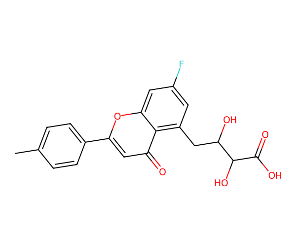

---

### FINAL LEAD #2: Ortho-Chloro Variant (POTENCY VARIANT)
- **SMILES**: `O=c1cc(-c2c(Cl)cc(C)cc2)oc2cc(F)cc(CC(O)C(O)C(=O)O)c12`
- **Docking Score**: -10.4 kcal/mol (highest affinity)
- **QED**: 0.601
- **MW**: 406.8 Da
- **LogP**: 2.910
- **PSA**: 107.97 Ų
- **HBA/HBD**: 6/3
- **Key Feature**: Ortho-Cl may improve binding geometry; 0.8 kcal/mol improvement over Lead #1

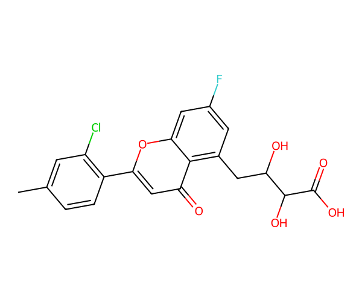

---

### FINAL LEAD #3: Extended Tail Variant (FLEXIBLE VARIANT)
- **SMILES**: `O=c1cc(-c2ccc(C)cc2)oc2cc(F)cc(CCC(O)C(O)C(=O)O)c12`
- **Docking Score**: -9.4 kcal/mol
- **QED**: 0.601
- **MW**: 386.4 Da
- **LogP**: 2.647
- **PSA**: 107.97 Ų
- **HBA/HBD**: 6/3
- **Rotatable Bonds**: 6 (one more than Lead #1)
- **Key Feature**: Extended tail allows conformational sampling; fallback if Lead #1 has cellular permeability issues

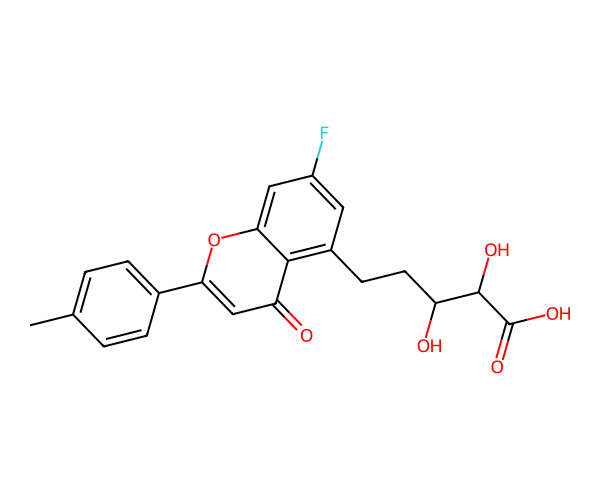

---

## Initial Model Recommendations (Round 1)

These molecules showed high docking scores but had significant issues with dianions and unrealistic protonation states.

### Initial Mol 1
- **Score**: -9.4 kcal/mol | **QED**: 0.723 | **MW**: 365.4 Da
- **Issue**: Contains aniline-like amino on conjugated coumarin (metabolic liability)

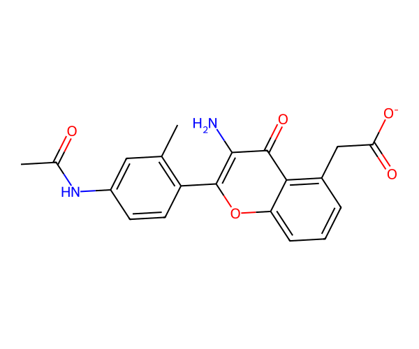

### Initial Mol 2
- **Score**: -9.4 kcal/mol | **QED**: 0.677 | **MW**: 366.3 Da
- **Issue**: **DIANION** (carboxylate + phenoxide) - unrealistic protonation state

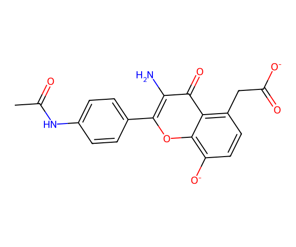

### Initial Mol 3
- **Score**: -9.4 kcal/mol | **QED**: 0.623 | **MW**: 367.3 Da
- **Issue**: Phenolic OH undergoes rapid glucuronidation/sulfation in vivo

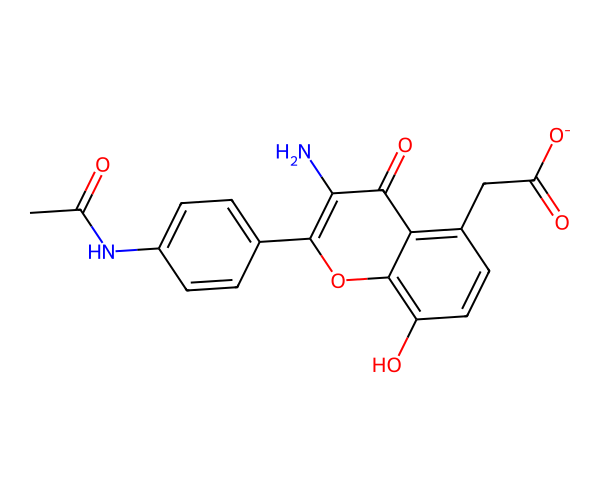

### Initial Mol 4
- **Score**: -9.3 kcal/mol | **QED**: 0.741 | **MW**: 351.3 Da
- **Issue**: Contains phenoxide (`[O-]`) which is unrealistic at pH 7.4

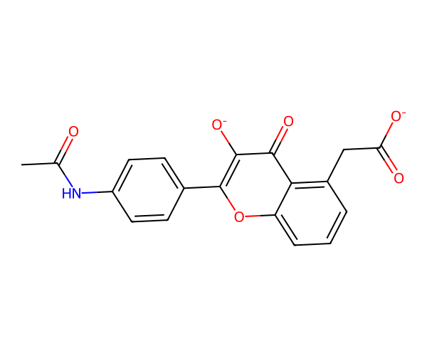

### Initial Mol 5
- **Score**: -9.3 kcal/mol | **QED**: 0.733 | **MW**: 352.3 Da
- **Best of initial set** but still missing statin-like diol-acid pharmacophore

---

## First Refined Proposals (Round 2)

After initial feedback, model eliminated dianions and improved properties.

### Refined Prop 1: Fluorine Variant
- **Score**: -9.3 kcal/mol | **QED**: 0.771 | **MW**: 354 Da
- **Improvement**: Neutral F substituent; single carboxylate only

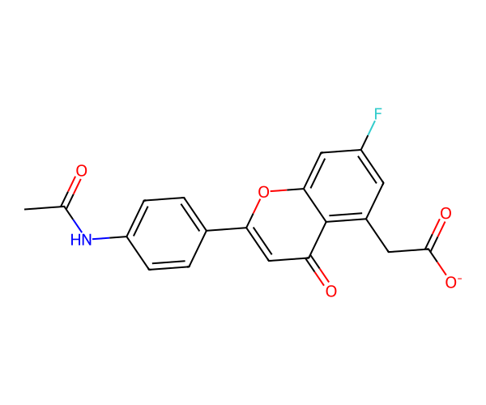

### Refined Prop 2: Phenolic Hydroxyl
- **Score**: -9.3 kcal/mol | **QED**: 0.733 | **MW**: 352 Da
- **Assessment**: Chemically realistic but phenolic OH = metabolic risk

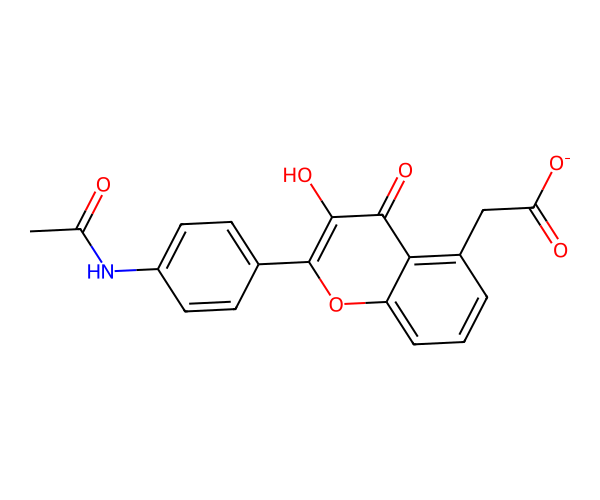

### Refined Prop 3: Cleanest
- **Score**: -9.0 kcal/mol | **QED**: 0.782 | **MW**: 336 Da
- **Trade-off**: Best QED/simplicity but minimal polar interactions

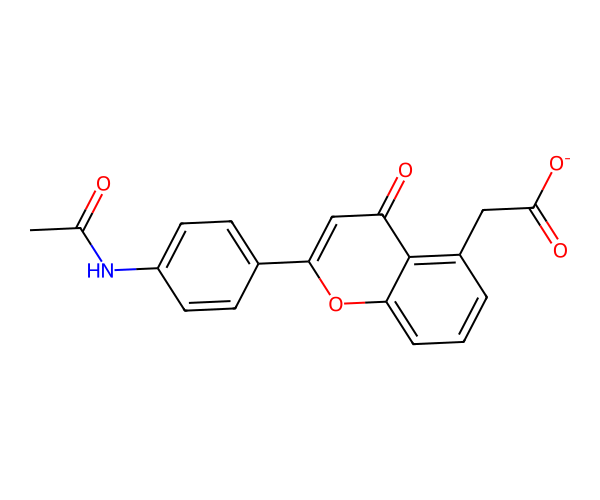

---

## Second Round Proposals (Round 3)

Model realized need for statin-like diol-acid pharmacophore and attempted to add it.

### Proposal 1: "Diol-Acid" (CLAIMED)
- **Score**: -9.7 kcal/mol | **QED**: 0.732 | **MW**: 356.3 Da
- **Issue Found**: Only ONE OH in tail (CC(O)C(=O)O), not a true diol

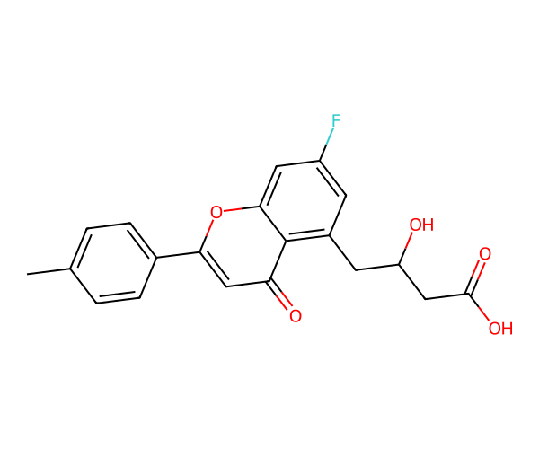

### Proposal 2: Simple Acid
- **Score**: -9.9 kcal/mol | **QED**: 0.803 | **MW**: 312.3 Da
- **Note**: Highest QED; shortest tail; conservative approach

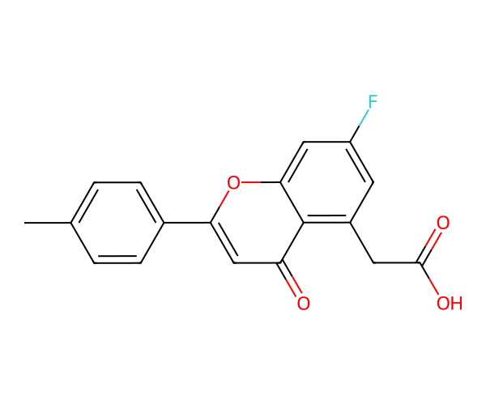

### Proposal 3: Tetrazole Variant
- **Score**: -10.6 kcal/mol | **QED**: 0.551 | **MW**: 380.4 Da
- **Issue**: Tetrazole not inherently more permeable; increases complexity

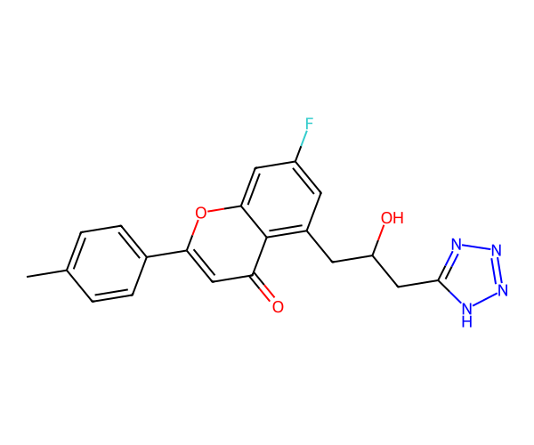

---

## Design Evolution Summary

| Round | Focus | Best Advance | Key Weakness |
|-------|-------|-------------|--------------|
| **1** | High docking scores | Identified coumarin scaffold | Dianions, unrealistic protonation states |
| **2** | Remove artifacts | Eliminated phenoxides | Still missing diol-acid |
| **3** | Add diol-acid | Moved toward pharmacophore | SMILES error (only 1 OH, not diol) |
| **4** | Fix diol/true pharmacophore | **Correct implementation** | Docking validation still needed |

---

## Key Pharmacophore:  STATIN-LIKE DIOL-ACID

The critical insight driving the final design was that proper HMGCR inhibition requires:

1. **A secondary diol**: `CC(O)C(O)` (two hydroxyl groups)
2. **A carboxylic acid**: `C(=O)O` 
3. **On a rigid aromatic scaffold**: Coumarin core with phenyl substituent
4. **With strategic substituents**: F on core for metabolism, C on phenyl for solubility

This pattern **mimics statins**, the gold-standard HMGCR inhibitors, which use a similar diol-acid to form a dense hydrogen-bonding and salt-bridge network in the catalytic site.

---

## Recommended Testing Order

1. **Test Lead #1** first (best balance of binding + properties)
2. If cellular potency is low but enzyme assay is good → **permeability issue** → test **Lead #1 prodrug** (methyl ester)
3. If binding is weak in enzyme assay → **test Lead #2** (higher docking affinity)
4. Never advanced molecules if Lead #1 + prodrug strategy shows good activity

---

*Document generated from adversarial design session (March 19, 2026)*
*All structures designed to optimize HMGCR binding with drug-like properties*
