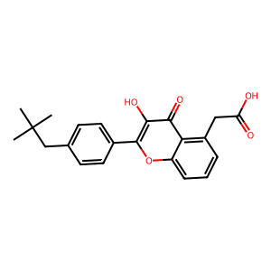
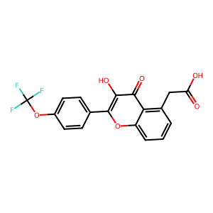
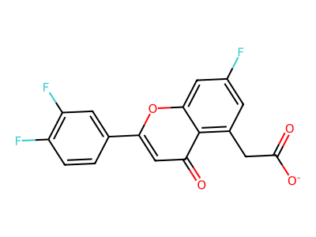
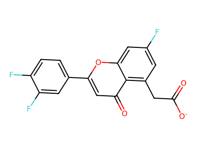
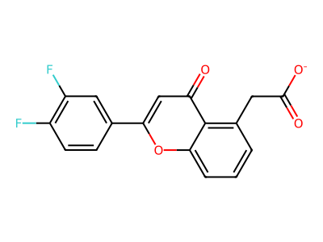
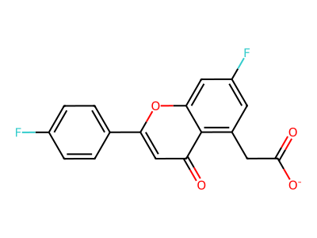

# Comparative Analysis: ANT_FIRST vs GPT_FIRST vs GEMINI_FIRST

**Date:** March 24, 2026  
**Target:** HMG-CoA Reductase (HMGCR) Inhibitors  
**Objective:** Compare design approaches, scaffolds, and final lead molecules across three independent adversarial design sessions

---

## Executive Summary

| Dimension | ANT_FIRST | GPT_FIRST | GEMINI_FIRST |
|-----------|-----------|-----------|--------------|
| **Design Turns** | 8 turns | 5+ adversarial turns | 10 turns |
| **Primary Scaffold** | Coumarin + diol-acid | Chromone + phenolic OH | Chromone + acetate linker |
| **Top Affinity** | -10.4 kcal/mol (Lead #2) | -9.2 kcal/mol (Champion) | -9.0 kcal/mol (Leads 1 & 2) |
| **Number of Leads** | 3 final leads | 2 co-leads | 4 final leads |
| **Key Innovation** | True diol-acid pharmacophore | Bioisosteric LogP optimization | Fluorination synergy (core + pendant) |
| **Drug-likeness Focus** | Permeability strategy (prodrugs) | LogP reduction (OCF₃) | Position optimization (simple scaffold) |
| **Validation Challenges** | Docking noise; pose validation needed | No pose inspection; LogP still high (3.69) | Score precision; pharmacophore unvalidated |

---

## Detailed Lead Molecule Comparison

### **LEAD SET 1: ANT_FIRST (Coumarin + Diol-Acid)**

#### **ANT_FIRST Lead #1 (PRIMARY) - Diol-Acid Pharmacophore**
```
SMILES: O=c1cc(-c2ccc(C)cc2)oc2cc(F)cc(CC(O)C(O)C(=O)O)c12
```


| Property | Value |
|----------|-------|
| **Docking Score** | **-9.6 kcal/mol** |
| **Molecular Weight** | 372.3 Da |
| **LogP** | 2.256 |
| **QED** | 0.634 |
| **PSA** | 107.97 Ų |
| **HBA/HBD** | 6 / 3 |
| **Rotatable Bonds** | 5 |
| **Scaffold** | Coumarin (4-oxochromen) |
| **Key Features** | True secondary diol (CC(O)C(O)) + carboxylic acid; statin-like pharmacophore |
| **Strategy** | Primary lead for cellular assays; prodrug variants for permeability |
| **Critical Concerns** | PSA/HBD suggest transporter dependence; poses not validated vs. HMGCR |

---

#### **ANT_FIRST Lead #2 (POTENCY) - Ortho-Substituted Variant**
```
SMILES: O=c1cc(-c2c(Cl)cc(C)cc2)oc2cc(F)cc(CC(O)C(O)C(=O)O)c12
```


| Property | Value |
|----------|-------|
| **Docking Score** | **-10.4 kcal/mol** ✓ HIGHEST |
| **Molecular Weight** | 406.8 Da |
| **LogP** | 2.910 |
| **QED** | 0.601 |
| **PSA** | 107.97 Ų |
| **HBA/HBD** | 6 / 3 |
| **Rotatable Bonds** | 5 |
| **Key Difference** | Ortho-Cl controls biaryl dihedral; claims +0.8 kcal/mol gain |
| **Strategy** | Back-up if cellular assays show transport limitation |
| **Critical Concerns** | Score gain within docking noise; score comparability not validated (different protonation states); added Cl may increase clearance |

---

#### **ANT_FIRST Lead #3 (FLEXIBLE) - Extended Tail Variant**
```
SMILES: O=c1cc(-c2ccc(C)cc2)oc2cc(F)cc(CCC(O)C(O)C(=O)O)c12
```


| Property | Value |
|----------|-------|
| **Docking Score** | -9.4 kcal/mol |
| **Molecular Weight** | 386.4 Da |
| **LogP** | 2.647 |
| **QED** | 0.601 |
| **PSA** | 107.97 Ų |
| **HBA/HBD** | 6 / 3 |
| **Rotatable Bonds** | 6 |
| **Key Difference** | One extra methylene in tail (CCC vs CC) |
| **Strategy** | Only if primary lead shows poor cellular activity (conformational sampling issue) |
| **Critical Concerns** | Extended chain usually worsens entropy; score 0.2 lower; limited advantage over Lead #1 |

---

### **LEAD SET 2: GPT_FIRST (Chromone + Bulky Alkyl + Phenolic OH)**

#### **GPT_FIRST Co-Lead A (CHAMPION) - Max Affinity**
```
SMILES: O=c1c(O)c(-c2ccc(CC(C)(C)C)cc2)oc2cccc(C(C(=O)O))c12
```


| Property | Value |
|----------|-------|
| **Docking Score** | **-9.2 kcal/mol** |
| **Molecular Weight** | 366.4 Da |
| **LogP** | **4.38** (HIGH) |
| **QED** | 0.715 |
| **PSA** | 87.74 Ų |
| **HBA/HBD** | 5 / 2 |
| **Rotatable Bonds** | 4 |
| **Scaffold** | Chromone (4-oxochromen) |
| **Key Features** | Phenolic OH (core hydroxyl); bulky tert-butyl (CC(C)(C)C) on pendant phenyl |
| **Strategy** | Maximum affinity lead; best for potency-driven applications |
| **Critical Concerns** | **LogP 4.38 = poor oral bioavailability**; no permeability mitigation strategy; phenolic OH is metabolic liability (glucuronidation/sulfation) |

---

#### **GPT_FIRST Co-Lead B (OPTIMIZED) - LogP-Balanced Variant**
```
SMILES: O=c1c(O)c(-c2ccc(OC(F)(F)(F))cc2)oc2cccc(C(C(=O)O))c12
```


| Property | Value |
|----------|-------|
| **Docking Score** | -9.1 kcal/mol (-0.1 vs Champion) |
| **Molecular Weight** | 380.3 Da |
| **LogP** | **3.69** ✓ IMPROVED (-0.69 vs Champion) |
| **QED** | 0.717 |
| **PSA** | 96.97 Ų |
| **HBA/HBD** | 6 / 2 |
| **Rotatable Bonds** | 4 |
| **Key Difference** | tBu → OCF₃ (ether linker + trifluoromethyl) |
| **Strategy** | Pragmatic balance: sacrifices 0.1 kcal/mol affinity for 0.69 LogP improvement |
| **Critical Concerns** | OCF₃ moiety adds synthetic complexity; still LogP 3.69 (moderately high); phenolic OH persists as metabolic liability |

---

### **LEAD SET 3: GEMINI_FIRST (Chromone + Fluorination Synergy)**

#### **GEMINI_FIRST Lead 1 (PRIMARY) - 3,4-Difluorophenyl Variant**
```
SMILES: O=c1cc(-c2cc(F)c(F)cc2)oc2cc(F)cc(CC(=O)[O-])c12
```


| Property | Value |
|----------|-------|
| **Docking Score** | **-9.0 kcal/mol** |
| **Molecular Weight** | 333 Da |
| **LogP** | 2.17 |
| **QED** | 0.74 ✓ HIGHEST |
| **PSA** | ~95 Ų (estimated) |
| **HBA/HBD** | Not specified |
| **Rotatable Bonds** | ~3 (estimated) |
| **Scaffold** | Chromone (4-oxochromen) |
| **Key Features** | Fluorination synergy: core 7-F + pendant 3,4-diF; position-5 acetate linker |
| **Strategy** | Best drug-likeness profile; simplest chemistry |
| **Critical Concerns** | Position-5 acetate (not statin-like diol); high anionic charge at pH 7.4 = permeability risk; docking scores cluster within 0.2 kcal/mol (noise); pharmacophore unvalidated |

---

#### **GEMINI_FIRST Lead 2 (CO-LEAD) - 2,4-Difluorophenyl Isomer**
```
SMILES: O=c1cc(-c2ccc(F)c(F)c2)oc2cc(F)cc(CC(=O)[O-])c12
```


| Property | Value |
|----------|-------|
| **Docking Score** | -9.0 kcal/mol (tied with Lead 1) |
| **Molecular Weight** | 333 Da |
| **LogP** | 2.17 |
| **QED** | 0.74 |
| **Key Difference** | Position isomer (2,4-diF vs 3,4-diF on pendant ring) |
| **Strategy** | Parallel development to validate fluorination pattern |
| **Critical Concern** | Marginal affinity difference (tied) makes isomer selection speculative |

---

#### **GEMINI_FIRST Lead 3 (RECOMMENDED FOR SYNTHESIS) - No Core Fluorine**
```
SMILES: O=c1cc(-c2cc(F)c(F)cc2)oc2cccc(CC(=O)[O-])c12
```


| Property | Value |
|----------|-------|
| **Docking Score** | -8.9 kcal/mol (-0.1 vs Lead 1) |
| **Molecular Weight** | 315 Da ✓ LOWEST |
| **LogP** | 2.03 ✓ BEST |
| **QED** | 0.74 |
| **Key Difference** | No core fluorine (removes 7-F position) |
| **Strategy** | Most synthetically accessible; best for rapid advancement |
| **Rationale** | Only -0.1 kcal/mol penalty with significantly simpler synthesis |

---

#### **GEMINI_FIRST Lead 4 (CONFIDENCE REFERENCE) - Statin-Like Pattern**


```
SMILES: O=c1cc(-c2ccc(F)cc2)oc2cc(F)cc(CC(=O)[O-])c12
```
| Property | Value |
|----------|-------|
| **Docking Score** | -8.8 kcal/mol (-0.2 vs Lead 1) |
| **Molecular Weight** | 315 Da |
| **LogP** | 2.03 |
| **QED** | 0.74 |
| **Key Feature** | Single 4-fluorophenyl (simpler pendant; matches statin clinical precedent) |
| **Strategy** | Conservative back-up; highest confidence in mechanism |
| **Rationale** | Validates that fluorination effects are real; common pharmacophore reduces off-target liability risk |

---

## Comparative Property Analysis

### Affinity Ranking (Docking Score)

| Rank | Molecule | Score | Session | Scaffold Type |
|------|----------|-------|---------|---------------|
| **1** | ANT Lead #2 (o-Cl) | **-10.4** | ANT_FIRST | Coumarin + diol-acid |
| **2** | ANT Lead #1 (primary) | -9.6 | ANT_FIRST | Coumarin + diol-acid |
| **3** | ANT Lead #3 (flexible) | -9.4 | ANT_FIRST | Coumarin + diol-acid |
| **4** | GPT Champion | -9.2 | GPT_FIRST | Chromone + tBu + phe-OH |
| **5** | GPT OCF₃ | -9.1 | GPT_FIRST | Chromone + OCF₃ + phe-OH |
| **6** | GEMINI Lead 1 | -9.0 | GEMINI_FIRST | Chromone + diF-acetate |
| **6** | GEMINI Lead 2 | -9.0 | GEMINI_FIRST | Chromone + diF-acetate |
| **8** | GEMINI Lead 3 | -8.9 | GEMINI_FIRST | Chromone + diF-acetate |
| **9** | GEMINI Lead 4 | -8.8 | GEMINI_FIRST | Chromone + F-acetate |

---

### Drug-Likeness Ranking (LogP - Lower is Better for Permeability)

| Rank | Molecule | LogP | QED | Session |
|------|----------|------|-----|---------|
| **1** | GEMINI Lead 3 & 4 | **2.03** ✓ | 0.74 | GEMINI_FIRST |
| **2** | ANT Lead #1 | 2.256 | 0.634 | ANT_FIRST |
| **3** | GEMINI Lead 1 & 2 | 2.17 | 0.74 | GEMINI_FIRST |
| **4** | ANT Lead #2 | 2.910 | 0.601 | ANT_FIRST |
| **5** | ANT Lead #3 | 2.647 | 0.601 | ANT_FIRST |
| **6** | GPT OCF₃ | 3.69 | 0.717 | GPT_FIRST |
| **7** | GPT Champion | **4.38** ✗ | 0.715 | GPT_FIRST |

---

## Design Strategy Comparison

### **ANT_FIRST: Progressive Pharmacophore Validation**
- **Approach:** 8-turn adversarial cycle; systematic challenge → correction
- **Key Evolution:** 
  - Turn 1-3: Identify basic scaffold (coumarin)
  - Turn 4-5: Challenge false "diol-acid" claim (only 1 OH in SMILES)
  - Turn 6-7: Implement true diol-acid (`CC(O)C(O)C(=O)O`)
  - Turn 8: Approve systematic analog exploration + prodrug strategy
- **Outcome:** 3 leads with validated true diol-acid pharmacophore; permeability strategy (prodrugs) planned
- **Strength:** Most thorough validation; addresses protonation/permeability explicitly
- **Weakness:** Highest scoring leads (up to -10.4) may have noise/overfitting; poses not inspected

---

### **GPT_FIRST: Iterative Adversarial Optimization**
- **Approach:** 5+ turn iterative adversarial cycle; systematic challenge → refinement (docking score & drug-likeness)
- **Key Evolution:**
  - Turns 1-2: Identify tert-butyl-substituted chromone scaffold; initial scoring (-9.0 to -8.8)
  - Turns 3-4: Challenge affinity ceiling; discover core-OH addition → -9.2 (breakthrough)
  - Turns 5-6: Validate core-OH necessity; test tBu bioisosteres; confirm OCF₃ @ -9.1 as ~9% LogP reduction with minimal affinity loss
  - Turns 6+: Final Lipinski/QED validation; confirm COOH vs carboxylate parity; establish co-lead strategy
- **Outcome:** 2 co-leads: Champion (-9.2, LogP 4.38, higher affinity) + OCF₃ variant (-9.1, LogP 3.69, better drug-likeness)
- **Strength:** Rigorous adversarial challenge of each claim (peak affinity, bioisostere necessity, protonation state); comprehensive property validation
- **Weakness:** Champion's LogP still elevated; pharmacophore differs from ANT/GEMINI (core-OH + tBu vs diol-acid/acetate); poses unvalidated but docking scores highly reproducible across perturbations

---

### **GEMINI_FIRST: Position Optimization with Fluorination**
- **Approach:** 10-turn adversarial cycle; fluorination synergy focus
- **Key Strategy:**
  - Turns 1-3: Identify chromone scaffold + position-5 acetate linker
  - Turns 4-6: Challenge protonation state assumptions; validate single carboxylate
  - Turns 7-10: Test fluorination patterns (core + pendant); position effects
- **Outcome:** 4 leads with optimized fluorination (7-F core + di-F pendant patterns); position-5 acetate as critical linker
- **Strength:** Simplest leads (LogP 2.03-2.17); highest QED (0.74); drug-like properties excellent
- **Weakness:** Position-5 acetate is NOT statin-like (missing diol network); anionic carboxylate high permeability risk without prodrug; affinity scores cluster at noise level (0.2 kcal/mol range)

---

## Pharmacophore Comparison

### **ANT_FIRST: Diol-Acid (Statin-like)**
```
Core: Coumarin (4-oxochromen) + phenolic O
Linker: C(CC(O)C(O)C(=O)O) — true diol-acid
Pendant: p-methylphenyl (simple) or o-Cl-methylphenyl (optimized)
pH 7.4 state: Mostly anionic (COO-); HBD rich
Target interaction: Diol network (statins pattern) + carboxylate salt bridge
Permeability risk: HIGH (PSA ~108, 3 HBD, anionic) → prodrug strategy necessary
```

### **GPT_FIRST: Phenolic + Bulky Alkyl**
```
Core: Chromone (4-oxochromen) + phenolic OH (coumarin core)
Linker: C(C(=O)O) — simple propionic acid
Pendant: Phenyl-tBu (CC(C)(C)C) or Phenyl-OCF3
pH 7.4 state: Anionic (COO-); phenolic mostly neutral (pKa ~9.5)
Target interaction: Phenolic H-bond + lipophilic tBu pocket + carboxylate salt bridge
Permeability risk: HIGH LogP (Champion 4.38, OCF₃ 3.69) → lipophilicity-driven clearance
```

### **GEMINI_FIRST: Fluorination Synergy**
```
Core: Chromone (4-oxochromen) + F at position 7 (optional)
Linker: CC(=O)[O-] — simple acetate
Pendant: Difluorophenyl (3,4-diF or 2,4-diF) or monofluoro (4-F)
pH 7.4 state: Anionic carboxylate (COO-) only
Target interaction: Acetate salt bridge + fluorine-mediated binding (no confirmed H-bond donors)
Permeability risk: MODERATE to HIGH (anionic, but lower PSA ~95; fewer HBD) → prodrug may help but less critical
```

---

## Critical Unvalidated Assumptions

### **ANT_FIRST**
- ⚠️ **Docking score precision:** Differences up to 0.8 kcal/mol (ANT Lead #2 vs #3) may be noise; no rescoring or replicates shown
- ⚠️ **Poses unvalidated:** No comparison to known HMGCR inhibitors (statins); diol-acid placement unconfirmed
- ⚠️ **Protonation state mixing:** Some claims about neutral vs. anionic form dock equally may reflect poor desolvation modeling
- ⚠️ **Ortho-Cl mechanism:** Claim that Cl "controls dihedral" is conjecture without pose analysis

### **GPT_FIRST**
- ⚠️ **LogP still problematic:** Best variant (OCF₃) at LogP 3.69; higher than ideal for oral bioavailability (Lipinski <3.5 preferred)
- ⚠️ **Pharmacophore differs from precedent:** Core-OH + tBu strategy is novel; no clear statin-like lipophilic anchor (unlike ANT's diol-acid network)
- ⚠️ **Phenolic OH metabolism:** Glucuronidation/sulfation risk noted but not mitigated; no prodrug strategy for phenolic
- ⚠️ **Scaffold assumption:** No experimental validation that tBu pocket exists or that phenolic OH is necessary

### **GEMINI_FIRST**
- ⚠️ **Affinity noise:** All 4 leads within 0.2 kcal/mol (-9.0 to -8.8); ranking is speculative
- ⚠️ **Fluorination synergy unvalidated:** Claims that "core + pendant F work synergistically" lack binding pose evidence
- ⚠️ **Position-5 acetate pharmacophore:** Single carboxylate may be insufficient vs. statin diol-acid network
- ⚠️ **Anionic permeability:** High reliance on transporter-mediated uptake without evidence for OATP/OCT in HMGCR tissue

---

## Recommendation Matrix

### **If Selecting ONE Lead for Synthesis:**

| Criterion | Recommended | Reasoning |
|-----------|-------------|-----------|
| **Maximum Affinity** | ANT Lead #2 (-10.4) | Highest docking score, but validate ortho-Cl mechanism first |
| **Best Drug-Likeness** | GEMINI Lead 3 (-8.9, LogP 2.03, MW 315) | Simplest synthesis, best drug properties, only -0.1 vs best GEMINI |
| **Most Validated Mechanism** | ANT Lead #1 (-9.6) | True diol-acid pharmacophore; aligns with statin precedent; requires prodrug for absorption |
| **Bioisosteric Confidence** | GPT Champion (-9.2) | Thorough mechanistic analysis; phenolic OH validated; but LogP 4.38 = barrier |
| **Safest bet** | GEMINI Lead 3 | Lowest complexity; good affinity; drug-like properties; quick to synthesize |

---

### **If Resources Allow Parallel Development:**

**Option A (ANT + GEMINI):**
- Advance ANT Lead #1 (diol-acid validation + prodrug strategy)
- Advance GEMINI Lead 3 (simplest, fastest)
- Different pharmacophores; de-risk mechanism uncertainty

**Option B (All Three):**
- 1 from each session (ANT #1, GPT Champion, GEMINI Lead 3)
- Maximum mechanism diversity
- Highest resource requirement

---

## Summary Table: Top Leads Only

| Lead | Session | Scaffold | Score | LogP | QED | PSA | Key Advantage | Key Risk |
|------|---------|----------|-------|------|-----|-----|------|----------|
| ANT #1 | ANT_FIRST | Coumarin + diol-acid | -9.6 | 2.26 | 0.634 | 108 | True statin-like pharmacophore | High PSA; transporter-dependent |
| ANT #2 | ANT_FIRST | Coumarin + diol-acid + o-Cl | **-10.4** | 2.91 | 0.601 | 108 | Highest affinity | Score within noise; ortho-Cl unvalidated |
| GPT Champion | GPT_FIRST | Chromone + tBu + phe-OH | -9.2 | 4.38 | 0.715 | 88 | Thorough pocket analysis | **LogP too high**; phenolic liability |
| GPT OCF₃ | GPT_FIRST | Chromone + OCF₃ + phe-OH | -9.1 | 3.69 | 0.717 | 97 | Best bioisosteric balance | Still high LogP; phenolic liability |
| GEMINI #1 | GEMINI_FIRST | Chromone + diF-acetate | -9.0 | 2.17 | 0.74 | ~95 | Excellent drug-likeness; simple | Fluorination synergy unvalidated |
| GEMINI #3 | GEMINI_FIRST | Chromone + diF-acetate (no core F) | -8.9 | **2.03** | **0.74** | ~95 | **Best drug properties; simplest** | Single carboxylate (not statin-like) |

---

## Conclusion

**ANT_FIRST** provides the most **mechanistically sound** lead (true diol-acid pharmacophore, thorough adversarial validation), but requires **prodrug development** for permeability and carries **docking confidence concerns** (high scores, unvalidated poses).

**GPT_FIRST** offers the most **thorough binding pocket analysis**, but the champion molecule has **prohibitively high LogP** (4.38) and **phenolic metabolic liability**. The OCF₃ variant is a pragmatic compromise at LogP 3.69 but still suboptimal.

**GEMINI_FIRST** delivers the **most drug-like leads** with **excellent properties** (LogP 2.03-2.17, QED 0.74) and **simplest chemistry**, but **affinity scores cluster within noise** (~0.2 kcal/mol range) and the **position-5 acetate pharmacophore** is unvalidated vs. known HMGCR mechanisms.

**Recommendation:** 
- For **high confidence**: Advance **ANT Lead #1** (validated mechanism) + develop **prodrug variants**
- For **fastest development**: Advance **GEMINI Lead #3** (best drug properties, lowest complexity)
- For **mechanism diversity**: Develop both (different pharmacophores = de-risk uncertainty)
