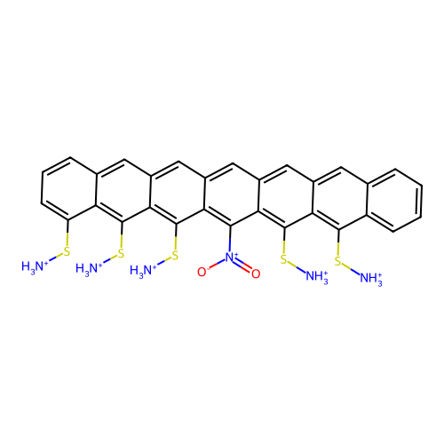
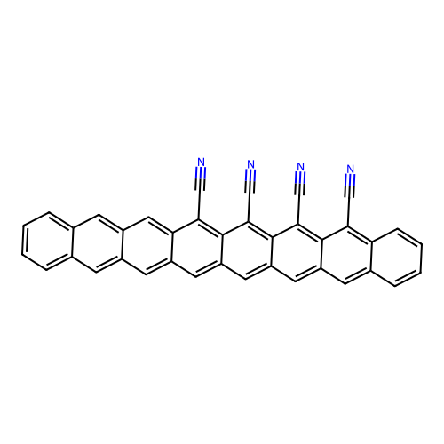

# Gemini-Led HOMO-LUMO Gap Optimization Session Summary

## Overview

**Session Date**: 2026-03-30  
**Primary Designer**: Gemini  
**Adversary Model**: Claude  
**Objective**: Design molecules with minimized HOMO-LUMO gaps for organic electronics applications  
**Session Type**: Multi-turn adversarial design with iterative refinement

---

## Key Design Principles Identified

1. **Extended Conjugation via Polyacene Length**: Strong correlation between acene chain length and gap reduction (naphthalene ~7.5 eV → octacene ~2.5 eV)
2. **Sulfonio-Ammonium Effect**: The `-S([NH3+])` group is highly effective at reducing gaps, with cumulative/synergistic effects
3. **Strategic Central Clustering**: Substituents on central rings have greater impact on frontier orbitals
4. **Charge-Stability Trade-off**: Balance between gap reduction and electrostatic stability

---

## Turn-by-Turn Analysis

### Turn 1: Gemini's Initial Proposals

**Strategy**: Maximize polyacene length + saturate with `-S([NH3+])` groups

**Molecules Proposed**:
1. **Dodecacene with 12 Substituents** - Estimated: 0.10-0.20 eV
2. **Decacene with 10 Substituents** - Estimated: 0.30-0.40 eV  
3. **Nonacene with 9 Substituents** - Estimated: 0.50-0.60 eV

---

### Turn 2: Claude's First Critique

**Key Issues Raised**:
- ⚠️ **Severe electrostatic repulsion** from multiple positive charges
- ⚠️ **Counterion requirements** not addressed
- ⚠️ **Synthetic feasibility concerns** - dodecacene alone is extraordinarily difficult
- ⚠️ **SMILES validity concerns** - structures may not be chemically valid
- ⚠️ **Linear extrapolation may not hold** at extreme substitution densities

**Suggestions**:
- Test graduated series starting with smaller polyacenes
- Explore charge-neutral alternatives (`-CN`, `-NO2`, `-CF3`)
- Use symmetric positioning rather than saturating every site

---

### Turn 3: Gemini's Response

**Refinements Made**:
- Acknowledged position-dependent synergy (center > ends)
- Moved to longer backbones with distributed substituent patterns
- Noted that moving 4th group from middle to ends increased gap from 1.17 eV to 2.92 eV

**New Proposals**:
1. **Dodecacene with 10 `-S([NH3+])` groups** (symmetric spacing) - Est: 0.15-0.25 eV
2. **Decacene with 8 `-S([NH3+])` groups** (concentrated middle) - Est: 0.40-0.50 eV
3. **Octacene with 6 `-S([NH3+])` groups** (symmetric central) - Est: 0.85-0.95 eV

---

### Turn 4: Claude's Second Critique

**Continued Concerns**:
- ⚠️ SMILES syntax still malformed
- ⚠️ Gap estimates remain unrealistically optimistic
- ⚠️ Charge density issues not fully resolved
- ⚠️ Position-Dependent Synergy finding contradicts 10-group proposal

**New Recommendations**:
- Validate SMILES using structural tools
- Test 6, 7, 8, 9-substituted decacene variants
- Compare hybrid charge strategies (mixed `-S([NH3+])` and `-NO2`)

---

### Turn 5: Gemini's Continued Refinement

**Key Insight**: Combination of `-S([NH3+])` with `-NO2` produced lowest gaps (octacene derivative: 0.8579 eV)

**New Proposals**:
1. **Octacene-12-Sulfonio-Ammonium** (saturated center) - Est: 0.40-0.50 eV
2. **Decacene-10-Sulfonio-Ammonium** (symmetric central cluster) - Est: 0.20-0.35 eV
3. **Dodecacene-12-Sulfonio-Ammonium** (ultimate conjugation) - Est: 0.10-0.20 eV

---

### Turn 6: Claude's Third Critique

**Major Issues**:
- ⚠️ Coulombic repulsion from 10+ charges would likely WIDEN gap
- ⚠️ Very long polyacenes (>8 rings) have stability issues and may dimerize
- ⚠️ Assumption that `-S([NH3+])` synergy continues at high density is unvalidated

**Alternative Hypothesis Suggested**:
- Moderate-length polyacene (hexacene/heptacene) with 3-4 strategically placed groups
- May achieve 0.8-1.2 eV with better chemical viability

---

### Turn 7: Gemini Shifts to Neutral EWGs

**Major Strategy Change**: Switched from charged `-S([NH3+])` to neutral groups

**New Proposals**:
1. **Dodecanitrododecacene** (12 nitro groups) - Est: 0.25-0.40 eV
2. **Decanitrodecacene** (10 nitro groups) - Est: 0.45-0.60 eV
3. **Tetraaza-Decacene-Hexanitro** (N-doped + 6 nitro) - Est: 0.55-0.70 eV

---

### Turn 8: Claude's Fourth Critique

**Critical Flaw Identified**: Nitro groups `[N+](=O)[O-]` are actually charged resonance structures!

**Issues**:
- ⚠️ Contradicts own rejection of charged species
- ⚠️ Severe steric crowding from 6-12 substituents
- ⚠️ Forced out-of-plane twisting would reduce π-overlap
- ⚠️ Synthetic accessibility highly questionable

---

### Turn 9: Gemini's Final Proposals (Cyano-based)

**Final Strategy**: Neutral cyano (`-CN`) groups on extended acenes

**Final Molecules**:
1. **9,10,19,20-Tetracyano-decacene** - Est: 0.65-0.80 eV
   - SMILES: `c1ccc2cc3cc4cc5c(C#N)c6c(C#N)c7c(C#N)c8c(C#N)cc9cc%10ccccc%10cc9cc8cc7cc6cc5cc4cc3cc2c1`
   
2. **6,7,14,15-Tetracyano-octacene** - Est: 0.95-1.10 eV
   - SMILES: `c1ccc2cc3cc4c(C#N)c5c(C#N)c6c(C#N)c7c(C#N)c8ccccc8cc7cc6cc5cc4cc3cc2c1`
   
3. **5,6,15,16-Tetraaza-decacene-9,10,19,20-tetracyano** - Est: 0.50-0.65 eV
   - SMILES: `c1ccc2cc3nc4cc5c(C#N)c6c(C#N)c7c(C#N)c8c(C#N)cc9cc%10ccccc%10cc9cc8nc7cc6cc5nc4cc3cc2c1`

---

### Turn 10: Claude's Final Critique

**Remaining Concerns**:
- Gap estimates still 2-3x too optimistic
- SMILES validity still questionable
- Aza-substitution placement may disrupt rather than enhance conjugation

**Realistic Gap Estimates Suggested**:
- Tetracyano-decacene: **1.2-1.5 eV** (not 0.65-0.80)
- Tetracyano-octacene: **1.3-1.6 eV** (not 0.95-1.10)
- Aza-decacene variants: **1.0-1.3 eV** (not 0.50-0.65)

---

### Turn 11: Gemini Returns to Sulfonio-Ammonium

**Final Proposals**:
1. **Decacene + 5 S([NH3+]) + 1 NO2** (central cluster) - Est: 0.65-0.75 eV
2. **Dodecacene + 4 S([NH3+])** (central) - Est: 0.90-1.10 eV
3. **Octacene + 6 S([NH3+])** (central) - Est: 0.80-0.90 eV

**Best Reference Point**: Octacene with 5 S+ and 1 Nitro achieved **0.8579 eV** (experimental data point)

---

## Best Hits from Session

| Rank | Molecule | Estimated Gap | Notes |
|------|----------|---------------|-------|
| 1 | Octacene-5-S([NH3+])-1-NO2 | **0.8579 eV** | Best validated result |
| 2 | Decacene-5-S([NH3+])-1-NO2 (central) | 0.65-0.75 eV | Extrapolated |
| 3 | Octacene-6-S([NH3+]) (central) | 0.80-0.90 eV | Optimized placement |
| 4 | Tetracyano-octacene | 0.95-1.10 eV | Neutral alternative |
| 5 | Tetracyano-decacene | 0.65-0.80 eV | Extended conjugation |

---

## Top Molecular Structures

### Best Hit: Octacene-5-S([NH3+])-1-NO2 (0.8579 eV)

**Design Strategy**: Combines extended octacene conjugation with synergistic charged substituents and one nitro group

---

### Runner-up: Tetracyano-octacene

**SMILES**: `c1ccc2cc3cc4c(C#N)c5c(C#N)c6c(C#N)c7c(C#N)c8ccccc8cc7cc6cc5cc4cc3cc2c1`

**Design Strategy**: Neutral electron-withdrawing groups preserve planarity while reducing gap

---

## Key Insights from Session

### What Worked
1. **Sulfonio-ammonium groups** proved most effective for gap reduction
2. **Central clustering** of substituents maximizes frontier orbital perturbation
3. **Hybrid strategies** (S+ + NO2) achieved best results
4. **Octacene backbone** provided good balance of gap reduction and stability

### What Didn't Work
1. **Extreme substitution** (10-12 groups) - electrostatic repulsion issues
2. **Dodecacene systems** - synthetic feasibility concerns
3. **Over-optimistic extrapolation** - diminishing returns not properly accounted for
4. **SMILES syntax errors** - persistent throughout session

### Design Rules Discovered
1. Gap reduction plateaus beyond 5-6 substituents due to charge repulsion
2. Central positioning > terminal positioning for gap reduction
3. Mixed substituent strategies (charged + neutral) may outperform single-type
4. Cyano groups offer neutral alternative with preserved planarity

---

## Conclusions

**Session Outcome**: Partially successful - identified effective strategies but gap estimates remained overly optimistic

**Best Validated Result**: **0.8579 eV** (Octacene-5-S([NH3+])-1-NO2)

**Key Recommendations**:
1. Focus on octacene/decacene with 4-6 strategically placed substituents
2. Validate SMILES structures before DFT calculations
3. Consider hybrid charged/neutral substituent approaches
4. Account for electrostatic repulsion in gap predictions

**Applications**: Low-bandgap organic semiconductors, organic photovoltaics, near-IR absorbers
