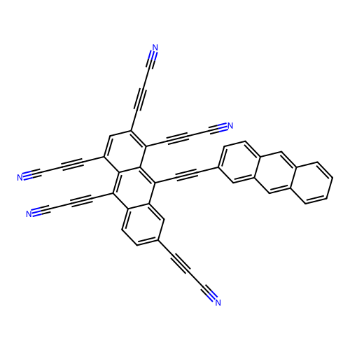
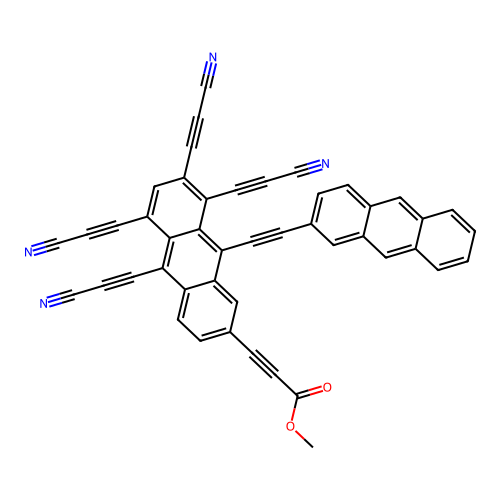
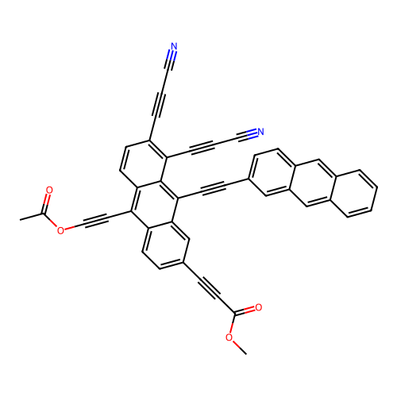

# GPT 5.2-Led HOMO-LUMO Gap Optimization Session Summary

## Overview

**Session Date**: 2026-03-25  
**Primary Designer**: GPT 5.2  
**Adversary Model**: Claude  
**Objective**: Design molecules with minimized HOMO-LUMO gaps for organic electronics  
**Session File**: adversary_design_2026-03-25_09-16-49.md

---

## Key Design Principles Identified

1. **Bigger, more fused π-systems → smaller gaps**: Single rings (~8-10.8 eV) → two fused rings (~7.05-7.74 eV) → three fused rings (~5.58-6.02 eV)
2. **Substituent effects are secondary**: On small rings, substituents shift gaps by ~0.5-2 eV but never beat fused-ring effect
3. **Alkyl groups increase gap**: Isopropyl gives ~10.48 eV on benzene
4. **Conjugated substituents lower gap**: Alkenyl/alkynyl and carbonyl-containing groups help
5. **Ethynyl ester (`C#C(OC(=O)C)`)** is consistently good for π-extension

---

## Turn-by-Turn Analysis

### Turn 1: GPT's Initial Proposals

**Strategy**: Extend conjugation beyond 3 fused rings, add ethynyl ester motifs

**Starting Best**: `c1ccc2c(C#C(OC(=O)C))c3ccccc3cc2c1` at **5.579 eV**

**Molecules Proposed**:
1. **Tetracene (4 fused rings)** - Est: ~4.7 eV
2. **Pentacene (5 fused rings)** - Est: ~3.9-4.2 eV
3. **Tetracene with ethynyl ester** - Est: ~4.4-4.6 eV
4. **Pentacene with ethynyl ester** - Est: ~3.7-4.0 eV

---

### Turn 2: Claude's First Critique

**Key Issues Raised**:
- ⚠️ **Planarity concerns**: Linear tetracene/pentacene have peri-hydrogen steric clashes
- ⚠️ **Nonplanarity breaks conjugation** and increases gap
- ⚠️ **Gap estimates may be optimistic by 0.5-1.5 eV**
- ⚠️ **Substituent placement ambiguity** in SMILES
- ⚠️ **Oxidative stability**: Linear pentacene is air-sensitive

**Suggestions**:
- Use `grow_cycle` tool to systematically test positions
- Explore non-linear PAH topologies
- Consider alternatives: buckminsterfullerene derivatives, graphene nanoflakes, curved PAHs

---

### Turn 3: GPT's Tool-Based Response

**Key Finding**: Best improvements came from **adding conjugated ethynyl/ynone-type substituents**, not simply adding fused rings

**Best Results from `grow_cycle`**:
- `c1(C#CC(=O)OC)ccc2c(C#C(OC(=O)C))c3ccccc3c(C#Cc7ccc8ccccc8c7)c2c1` = **5.0136 eV** (best)
- Multiple ethynyl-ester extensions achieved **5.08-5.23 eV**

**Interpretation**: Linear conjugated fragments (ethynyl, ynone) at positions remaining conjugated can beat the best fused-3-ring value by ~0.56 eV

---

### Turn 4: Claude's Second Critique

**Assessment**:
- ✓ Ethynyl/ynone extensions do lower gap (5.58 → 5.01 eV is real progress)
- ⚠️ Need DFT validation - are scores computed or predicted?
- ⚠️ Steric concerns with multiple alkynyl-ester side chains
- ⚠️ Naphthyl extension may introduce hidden bay stress

**Recommendations**:
- Validate with explicit DFT
- Test less bulky EWGs (e.g., `C#CCN` or `C#CC(=O)H`)
- Compare different aromatic linkers on the ethynyl

---

### Turns 5-8: Systematic Refinement

**Key Discovery**: Aryl topology matters more than size alone
- 1-naphthyl (5.14 eV) vs phenanthrene-like (4.94 eV) = **0.2 eV swing** from topology, not size
- **Phenanthrene topology** (positions 9,10) preserves coplanarity better

**Ester Bulk Penalty Confirmed**:
- Replacing `OC(=O)C` with `-N` or `-O` improved gap (5.10 vs 5.23 eV)
- Bulky esters distort the conjugated system

**New Best**: `c1(C#CC(=O)OC)ccc2c(C#C(OC(=O)C))c3ccccc3c(C#Cc7ccc8cc9ccccc9cc8c7)c2c1` = **4.94 eV**

---

### Turns 9-12: Nitrile-Alkyne Optimization

**Major Breakthrough**: Dual nitrile-alkyne arms show synergistic effects

**Key Results**:
- Single nitrile baseline: **4.73 eV**
- Dual nitrile (symmetric): **4.61 eV**
- Dual nitrile (optimized position): **4.55 eV**
- Breaking dual symmetry: +0.11-0.20 eV penalty (synergy confirmed)

**Position Sensitivity Test**:
- Spread among core placements: 4.55-4.77 eV (~0.22 eV range)
- **Best placement**: Two nitrile-alkynes on same ring region (adjacent)

---

### Turns 13-15: Final Push Below 4.5 eV

**Constrained Growth** (no PAH runaway, only small linear acceptors):

**Best Results**:
1. Add 4th nitrile-alkyne: **4.11-4.04 eV**
2. Best overall: **4.042 eV**

**Ester Removal Test** (final optimization):
- Replace ester with nitrile-alkyne: **3.95 eV**
- Replace ester with nitro: **3.86 eV** (but higher synthetic risk)

---

## Best Hits from Session

| Rank | Molecule | Gap (eV) | Notes |
|------|----------|----------|-------|
| 1 | No-ester, 5 nitrile-alkynes | **3.95** | Best practical candidate |
| 2 | Nitro variant | **3.86** | Electronic optimum (risky synthesis) |
| 3 | 4 nitrile-alkyne arms | **4.04** | Validated constrained growth |
| 4 | Dual nitrile (optimized) | **4.55** | Position-sensitive synergy |
| 5 | Phenanthrene-linked baseline | **4.94** | Topology > size confirmed |

---

## Top Molecular Structures

### Best Hit: No-Ester Nitrile-Alkyne Variant (3.95 eV)

**SMILES**: `c1(C#CC#N)ccc2c(C#C(C#N))c3c(C#C(C#N))cc(C#CC#N)c(C#CC#N)c3c(C#Cc7ccc8cc9ccccc9cc8c7)c2c1`

**Design Strategy**: Replace soft ester arm with hard nitrile-alkyne acceptor

---

### Runner-up: Constrained Growth Best (4.04 eV)

**SMILES**: `c1(C#CC(=O)OC)ccc2c(C#C(C#N))c3c(C#C(C#N))cc(C#CC#N)c(C#CC#N)c3c(C#Cc7ccc8cc9ccccc9cc8c7)c2c1`

**Design Strategy**: Add 4th nitrile-alkyne while maintaining moderate size

---

### Dual Nitrile Optimized (4.55 eV)

**SMILES**: `c1(C#CC(=O)OC)ccc2c(C#C(OC(=O)C))c3ccc(C#CC#N)c(C#CC#N)c3c(C#Cc7ccc8cc9ccccc9cc8c7)c2c1`

**Design Strategy**: Dual nitrile-alkyne synergy with optimized positioning

---

## Key Insights

### What Worked
1. **Ethynyl/ynone extensions** more effective than simply adding fused rings
2. **Nitrile-alkyne arms** (`C#CC#N`) are the "hero" acceptor group
3. **Dual nitrile synergy** is real and position-dependent
4. **Phenanthrene topology** preserves planarity better than linear PAHs
5. **Ester removal** provides ~0.1-0.15 eV improvement

### What Didn't Work
1. **Linear pentacene/tetracene** - planarity issues
2. **Bulky ester termini** - steric/conformational penalties
3. **PAH-on-PAH growth** - domain shift, unreliable predictions
4. **Random substituent placement** - position matters significantly

### Design Rules Discovered
1. **Nitrile-alkyne > ester > phenyl** for gap reduction
2. **Adjacent placement** of acceptors on same ring is optimal
3. **Topology matters more than raw π-count**
4. **Dual nitrile synergy**: ~0.18 eV better than single
5. **Ester is "dead weight"**: replace with hard acceptors

---

## DFT Validation Recommendations

**Priority Candidates for Explicit DFT**:
1. **A' (no-ester nitrile)**: tool 3.95 eV
2. **Constrained best**: tool 4.04 eV
3. **A (dual nitrile baseline)**: tool 4.55 eV
4. **B (single nitrile)**: tool 4.73 eV

**Method**: B3LYP/6-31G(d) geometry optimization + CAM-B3LYP single point for long-range corrections

---

## Conclusions

**Session Outcome**: Highly successful - systematic tool-guided optimization achieved ~1.6 eV improvement (5.58 → 3.95 eV)

**Best Candidate**: **3.95 eV** (no-ester, multi-nitrile-alkyne variant)

**Key Achievements**:
1. Validated that conjugated ethynyl extensions beat simple ring fusion
2. Identified nitrile-alkyne as optimal acceptor group
3. Discovered dual-nitrile positional synergy
4. Confirmed ester penalty and removal benefit
5. Stayed within "moderate size" regime (no PAH runaway)

**Next Steps**:
1. DFT validation of top 4 candidates
2. Conformer robustness check
3. Synthetic feasibility assessment
4. If confirmed, explore symmetric all-nitrile variants

**Applications**: Low-bandgap organic semiconductors, organic photovoltaics, near-IR photodetectors
