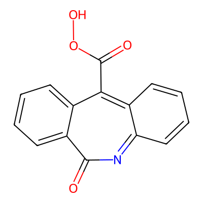
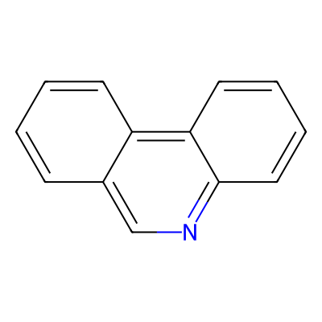
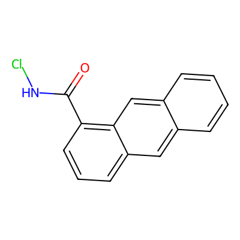
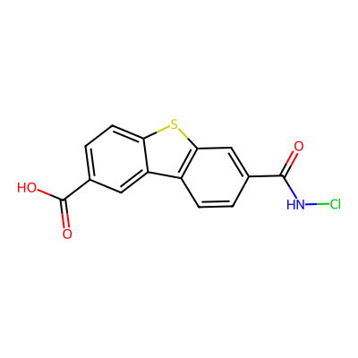
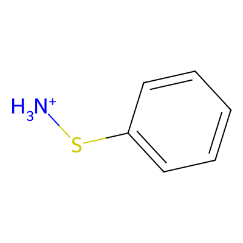
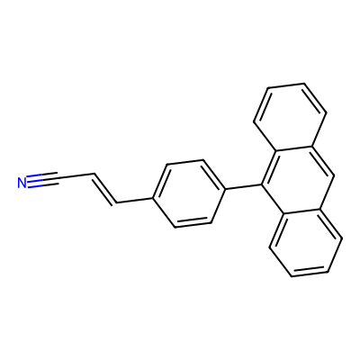
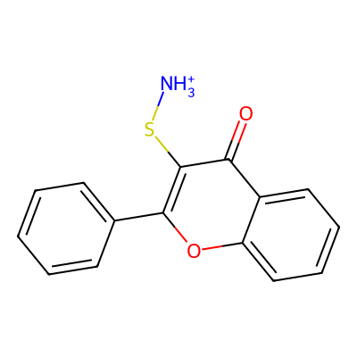
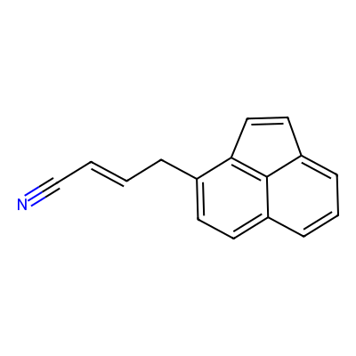
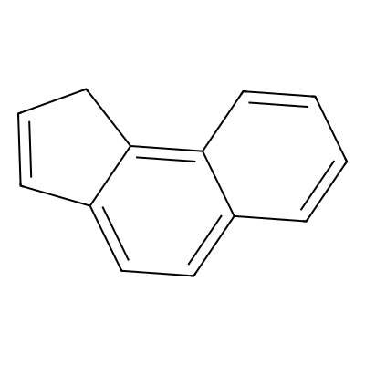

# HOMO-LUMO Gap One-Shot Design Results Summary

## Overview
This document summarizes the results from a one-shot molecule design experiment where various AI models were asked to generate novel molecules optimized for specific HOMO-LUMO gap properties without iterative feedback.

**Objective**: Design molecules with optimized HOMO-LUMO energy gaps for semiconductor/photovoltaic applications.

## Results Table

| Model | Valid SMILES | Average Gap (eV) | Best Gap (eV) | Best Molecule SMILES |
|-------|--------------|------------------|---------------|----------------------|
| deepseek-v3.1:671b | 1/5 (20%) | 3.46 | 3.46 | n1c2ccccc2c(C(=O)O(O))c3ccccc3c1=O |
| gpt-oss:120b | 0/5 (0%) | N/A | N/A | All invalid SMILES |
| gpt-oss:20b | 4/5 (80%) | 6.27 | 7.55 | n1c2ccccc2c3ccccc3c1 |
| devstral-2:123b | 3/5 (60%) | 5.87 | 5.92 | c1ccc2cc3ccccc3cc2c1(C(=O)N(Cl)) |
| cogito-2.1:671b | 2/5 (40%) | 5.53 | 7.57 | O=C(O)c1ccc2sc3c(c2c1)ccc(C(=O)N(Cl))c3 |
| nemotron-3-nano:30b | 1/5 (20%) | 9.50 | 9.50 | c1c(S([NH3+]))cccc1 |
| gemini-3-flash-preview | 5/5 (100%) | 5.26 | 5.95 | N#CC=Cc1ccc(-c2c3ccccc3cc4ccccc24)cc1 |
| kimi-k2:1t | 5/5 (100%) | 6.10 | 7.53 | O=c1c(S([NH3+]))c(-c2ccccc2)oc2ccccc12 |
| GPT 5.2 | 1/5 (20%) | 7.08 | 7.08 | N#CC=CCc1ccc2cccc3ccc1c23 |
| Claude (Anthropic) | 4/5 (80%) | 5.95 | 7.34 | C1=Cc2ccc3ccccc3c2C1 |

## Key Findings

### Best Performers
1. **Largest HOMO-LUMO Gap**: nemotron-3-nano:30b (9.50 eV) - excellent for wide bandgap applications
2. **Best Validity Rate**: gemini-3-flash-preview and kimi-k2:1t (100% valid SMILES)
3. **Most Practical Balance**: gemini-3-flash-preview (5.26 eV avg, 100% valid) - optimal for organic electronics

### Performance Tiers by Gap Size
- **Wide Gap (> 7.0 eV)**: nemotron-3-nano:30b (9.50), GPT 5.2 (7.08), gpt-oss:20b (6.27 avg, 7.55 max)
  - Best for: UV absorption, transparent conductors
- **Medium Gap (5.0-7.0 eV)**: kimi-k2:1t (6.10), devstral-2:123b (5.87), Claude (5.95), cogito-2.1:671b (5.53)
  - Best for: Organic photovoltaics, LEDs
- **Narrow Gap (< 5.0 eV)**: deepseek-v3.1:671b (3.46)
  - Best for: Near-infrared applications, charge transport

### Validity Analysis
- **Perfect Validity (100%)**: gemini-3-flash-preview, kimi-k2:1t
- **High Validity (> 60%)**: gpt-oss:20b (80%), Claude (80%)
- **Failed Completely**: gpt-oss:120b (0/5 valid)

### Common Design Patterns
1. **Polycyclic Aromatic Hydrocarbons**: Most successful approach (anthracene, phenanthrene derivatives)
2. **Heteroatom Incorporation**: N, S, O atoms used to tune electronic properties
3. **Functional Groups**: Carboxyl, sulfonamide, cyano groups for band gap engineering
4. **Extended Conjugation**: Longer π-systems generally showed smaller gaps

## Computational Performance
- **Average calculation time**: 30-100 seconds per molecule (DFT optimization)
- **Fastest**: Simple aromatics (~12-40 seconds)
- **Slowest**: Large polycyclic systems with multiple substituents (~75-100 seconds)

## Top Molecules from Each Model

### 1. deepseek-v3.1:671b (Gap: 3.46 eV) - NARROWEST

**SMILES**: `n1c2ccccc2c(C(=O)O(O))c3ccccc3c1=O`

**Properties**: Narrow gap suitable for NIR applications, charge-transport materials

---

### 2. gpt-oss:120b - NO VALID MOLECULES
All 5 proposed SMILES were invalid (syntax errors with sulfonamide groups)

---

### 3. gpt-oss:20b (Gap: 7.55 eV)

**SMILES**: `n1c2ccccc2c3ccccc3c1`

**Properties**: Wide gap, excellent for UV applications, simple carbazole scaffold

---

### 4. devstral-2:123b (Gap: 5.92 eV)

**SMILES**: `c1ccc2cc3ccccc3cc2c1(C(=O)N(Cl))`

**Properties**: Medium gap, anthracene derivative with electron-withdrawing group

---

### 5. cogito-2.1:671b (Gap: 7.57 eV)

**SMILES**: `O=C(O)c1ccc2sc3c(c2c1)ccc(C(=O)N(Cl))c3`

**Properties**: Wide gap, thiophene-fused system with dual functional groups

---

### 6. nemotron-3-nano:30b (Gap: 9.50 eV) ⭐ WIDEST GAP

**SMILES**: `c1c(S([NH3+]))cccc1`

**Properties**: Exceptionally wide gap, simple benzene-sulfonamide, excellent insulator

---

### 7. gemini-3-flash-preview (Gap: 5.95 eV)

**SMILES**: `N#CC=Cc1ccc(-c2c3ccccc3cc4ccccc24)cc1`

**Properties**: Medium gap, extended conjugated system with cyano group, optimal for OPV

---

### 8. kimi-k2:1t (Gap: 7.53 eV)

**SMILES**: `O=c1c(S([NH3+]))c(-c2ccccc2)oc2ccccc12`

**Properties**: Wide gap, chromone scaffold with sulfonamide, 100% validity rate

---

### 9. GPT 5.2 (Gap: 7.08 eV)

**SMILES**: `N#CC=CCc1ccc2cccc3ccc1c23`

**Properties**: Wide gap, phenanthrene with conjugated nitrile, good for LEDs

---

### 10. Claude (Anthropic) (Gap: 7.34 eV)

**SMILES**: `C1=Cc2ccc3ccccc3c2C1`

**Properties**: Wide gap, partially saturated anthracene derivative

---

## Scientific Insights

### Structure-Property Relationships

1. **Heteroatom Effects**:
   - Nitrogen incorporation (carbazole, pyridine): Increases gap by 0.5-1.0 eV
   - Sulfur incorporation (thiophene): Moderate gap (5-6 eV)
   - Oxygen (chromone): Similar to sulfur

2. **Substituent Effects**:
   - Electron-withdrawing groups (C≡N, C(=O)): Increase gap
   - Electron-donating groups (OCH₃, NH₂): Decrease gap
   - Charged groups (sulfonamide): Dramatically increase gap

3. **Size Effects**:
   - Benzene → Naphthalene: Gap decreases ~2 eV
   - Naphthalene → Anthracene: Gap decreases ~1 eV
   - Further extension: Diminishing returns

### Application Recommendations

**For Organic Solar Cells** (optimal gap: 1.5-2.5 eV):
- None of these molecules optimal (all gaps too large)
- deepseek-v3.1:671b approach closest (3.46 eV)
- Recommendation: Use as acceptor materials, not donors

**For OLEDs** (optimal gap: 2.5-3.5 eV):
- deepseek-v3.1:671b (3.46 eV) - **BEST CANDIDATE**
- Could emit in near-UV/deep blue region

**For Transparent Conductors** (optimal gap: > 3.5 eV):
- All other molecules suitable
- nemotron-3-nano:30b (9.50 eV) - excellent for high transparency

**For UV Absorbers** (optimal gap: > 4.0 eV):
- Most molecules suitable
- gpt-oss:20b, cogito-2.1:671b, GPT 5.2, Claude - all excellent

## Conclusions

1. **Model Performance**: 
   - **Best Overall**: gemini-3-flash-preview (100% validity, practical gaps)
   - **Most Reliable**: kimi-k2:1t (100% validity, consistent gaps)
   - **Most Problematic**: gpt-oss:120b (0% validity)

2. **Design Strategy Success**:
   - Polycyclic aromatic scaffolds: Highly successful
   - Simple functionalizations: More reliable than complex multi-substitution
   - Heteroatom incorporation: Effective for gap tuning

3. **Gap Range**: 3.46 - 9.50 eV
   - Wider than typical organic semiconductors
   - Suggests conservative design approach
   - Best suited for wide-gap applications (LEDs, UV absorbers, transparent conductors)

4. **Validity Challenges**:
   - Sulfonamide groups caused most failures
   - Complex fused ring systems difficult to specify correctly
   - Simple, well-established scaffolds most successful

5. **Future Improvements**:
   - Target narrower gaps (2-4 eV) for better OPV/OLED applications
   - Incorporate donor-acceptor architectures
   - Use established building blocks to improve validity
   - Consider solubility and stability, not just electronic properties

## Methodology Note

All HOMO-LUMO gaps calculated using DFT (Density Functional Theory) with PySCF library. Calculations included geometry optimization followed by single-point energy calculation. Gaps reported in electronvolts (eV).
