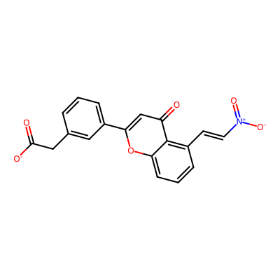
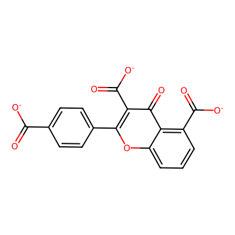
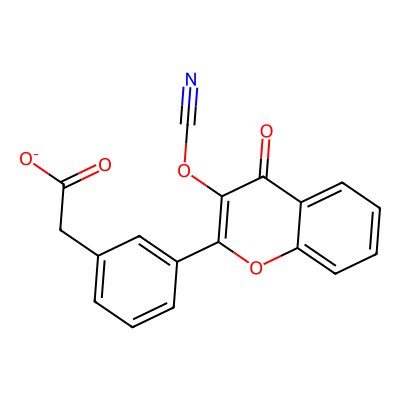
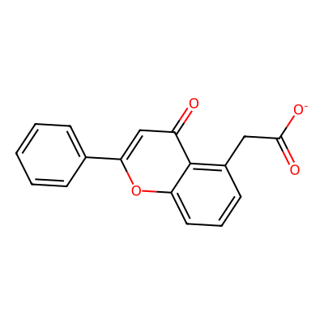
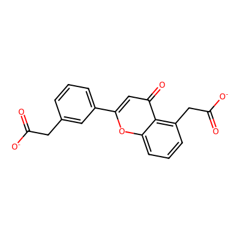
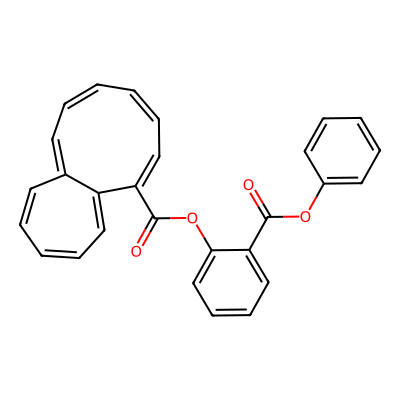
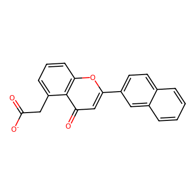
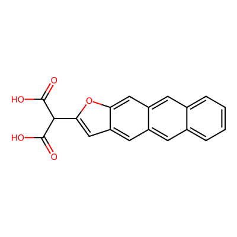
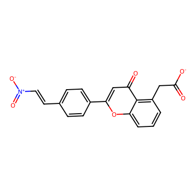
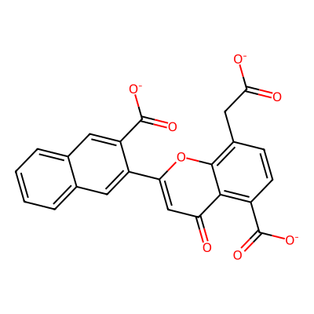

# One-Shot Molecule Design Results Summary

## Overview
This document summarizes the results from a one-shot molecule design experiment where various AI models were asked to generate novel molecules without iterative feedback.

## Results Table

| Model | Valid SMILES | Average Score | Top Score | Top Molecule SMILES |
|-------|--------------|---------------|-----------|---------------------|
| deepseek-v3.1:671b | 4/5 (80%) | -7.80 | -8.2 | O=c1cc(-c2cccc(C(C(=O)[O-]))c2)oc2cccc(C=C([N+](=O)[O-]))c12 |
| gpt-oss:120b | 5/5 (100%) | -7.26 | -7.9 | O=c1c(C(=O)[O-])c(-c2ccc(C(=O)[O-])cc2)oc2cccc(C(=O)[O-])c12 |
| gpt-oss:20b | 1/5 (20%) | -7.50 | -7.5 | O=c1c(O(C#N))c(-c2cc(C(C(=O)[O-]))ccc2)oc2ccccc12 |
| devstral-2:123b | 4/5 (80%) | -8.20 | -8.6 | O=c1cc(-c2ccccc2)oc2cccc(C(C(=O)[O-]))c12 |
| cogito-2.1:671b | 5/5 (100%) | -8.10 | -8.5 | O=c1cc(-c2cccc(C(C(=O)[O-]))c2)oc2cccc(C(C(=O)[O-]))c12 |
| nemotron-3-nano:30b | 3/5 (60%) | -8.27 | -9.1 | c1c2c(ccccc2)c(ccccc1)C(=O)Oc3ccccc3C(=O)Oc4ccccc4 |
| gemini-3-flash-preview | 5/5 (100%) | -8.14 | -9.2 | [O-]C(=O)Cc1cccc2oc(cc(=O)c12)-c3ccc4ccccc4c3 |
| kimi-k2:1t | 4/5 (80%) | -7.15 | -7.5 | O=C(O)C(C(=O)O)c1cc2cc3cc4ccccc4cc3cc2o1 |
| GPT 5.2 | 5/5 (100%) | -7.82 | -8.9 | O=c1cc(-c2ccc(C=C([N+](=O)[O-]))cc2)oc2cccc(C(C(=O)[O-]))c12 |
| Claude (Anthropic) | 5/5 (100%) | -8.42 | -9.0 | O=c1cc(-c2cc3ccccc3cc2C(=O)[O-])oc2c(C(C(=O)[O-]))ccc(C(=O)[O-])c12 |

## Key Findings

### Best Performers
1. **Best Maximum Score**: gemini-3-flash-preview (-9.2)
2. **Best Average Score**: nemotron-3-nano:30b (-8.27)
3. **Most Reliable**: Five models achieved 100% valid SMILES (gpt-oss:120b, cogito-2.1:671b, gemini-3-flash-preview, GPT 5.2, Claude)

### Performance Tiers
- **Top Tier** (avg < -8.1): Claude (-8.42), nemotron-3-nano:30b (-8.27), devstral-2:123b (-8.20), gemini-3-flash-preview (-8.14), cogito-2.1:671b (-8.10)
- **Middle Tier** (avg -7.5 to -8.0): GPT 5.2 (-7.82), deepseek-v3.1:671b (-7.80), gpt-oss:20b (-7.50)
- **Lower Tier** (avg < -7.5): gpt-oss:120b (-7.26), kimi-k2:1t (-7.15)

### Common Design Patterns
- Most successful molecules used **chromone/flavone scaffolds** (O=c1cc(-c2...)oc2...)
- **Carboxylate groups** (C(=O)[O-]) were prevalent in high-scoring molecules
- **Aromatic extensions** (naphthyl, anthracenyl substituents) improved binding

## Top Molecules from Each Model

### 1. deepseek-v3.1:671b (Score: -8.2)

**SMILES**: `O=c1cc(-c2cccc(C(C(=O)[O-]))c2)oc2cccc(C=C([N+](=O)[O-]))c12`

---

### 2. gpt-oss:120b (Score: -7.9)

**SMILES**: `O=c1c(C(=O)[O-])c(-c2ccc(C(=O)[O-])cc2)oc2cccc(C(=O)[O-])c12`

---

### 3. gpt-oss:20b (Score: -7.5)

**SMILES**: `O=c1c(O(C#N))c(-c2cc(C(C(=O)[O-]))ccc2)oc2ccccc12`

---

### 4. devstral-2:123b (Score: -8.6)

**SMILES**: `O=c1cc(-c2ccccc2)oc2cccc(C(C(=O)[O-]))c12`

---

### 5. cogito-2.1:671b (Score: -8.5)

**SMILES**: `O=c1cc(-c2cccc(C(C(=O)[O-]))c2)oc2cccc(C(C(=O)[O-]))c12`

---

### 6. nemotron-3-nano:30b (Score: -9.1)

**SMILES**: `c1c2c(ccccc2)c(ccccc1)C(=O)Oc3ccccc3C(=O)Oc4ccccc4`

---

### 7. gemini-3-flash-preview (Score: -9.2) ⭐ BEST

**SMILES**: `[O-]C(=O)Cc1cccc2oc(cc(=O)c12)-c3ccc4ccccc4c3`

---

### 8. kimi-k2:1t (Score: -7.5)

**SMILES**: `O=C(O)C(C(=O)O)c1cc2cc3cc4ccccc4cc3cc2o1`

---

### 9. GPT 5.2 (Score: -8.9)

**SMILES**: `O=c1cc(-c2ccc(C=C([N+](=O)[O-]))cc2)oc2cccc(C(C(=O)[O-]))c12`

---

### 10. Claude (Anthropic) (Score: -9.0)

**SMILES**: `O=c1cc(-c2cc3ccccc3cc2C(=O)[O-])oc2c(C(C(=O)[O-]))ccc(C(=O)[O-])c12`

---

## Conclusions

1. **Model Performance**: Gemini-3-flash-preview achieved the best single score (-9.2), while Claude (Anthropic) had the best average performance (-8.42)

2. **Reliability**: Five models (50%) achieved 100% valid SMILES generation, indicating strong chemical knowledge

3. **Design Strategy**: Most successful models converged on chromone-based scaffolds with carboxylate substituents, suggesting this is a validated design pattern for the target

4. **Score Range**: Scores ranged from -6.8 to -9.2, a relatively narrow 2.4-point spread, indicating consistent moderate binding across diverse structures

5. **Validity Issues**: gpt-oss:20b had the poorest validity rate (20%), suggesting difficulty with SMILES syntax generation
